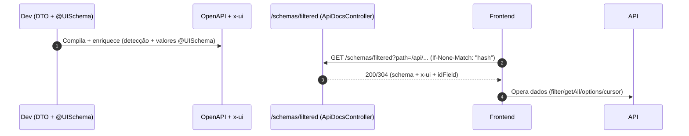

# Praxis Metadata Starter: APIs que se descrevem sozinhas e contratos que guiam a UI

Em muitos times, a camada de apresentação sofre com telas rígidas e divergência de regras entre back e front. O Praxis Metadata Starter nasceu para atacar a causa: publicar um contrato rico e auto‑descritivo (OpenAPI + `x-ui`) que a UI interpreta em tempo de execução — sem gerar código e sem acoplamento frágil.

Resultado prático: menos boilerplate, regras consistentes ponta‑a‑ponta e evolução contínua com segurança.

---

## O que o Starter entrega, na prática

- Anotação `@UISchema` para declarar metadados de UI diretamente nos DTOs/entidades.
- Enriquecimento automático do OpenAPI com a extensão `x-ui` (validações, controles, hints).
- Endpoint self‑describing `/schemas/filtered` (via `ApiDocsController`) com ETag, idField e merge inteligente.
- Detecção de grupos OpenAPI por path (OpenApiGroupResolver) e cache de documentos.
- Infra CRUD base (`AbstractCrudController`, `AbstractBaseCrudService`), HATEOAS e `RestApiResponse` consistente.
- Integração com Bean Validation (Jakarta): `@NotBlank`, `@Size`, etc. viram `x-ui.validation` consumível no front.



---

## Como modelar: do DTO ao contrato

1) Modele DTOs com Bean Validation e `@UISchema`:

```java
import jakarta.validation.constraints.*;
import org.praxisplatform.uischema.extension.annotation.UISchema;
import org.praxisplatform.uischema.FieldControlType;
import org.praxisplatform.uischema.FieldDataType;

public class ValorParametroInstituicaoItemDTO {
  @UISchema(label = "Parâmetro")
  @NotBlank @Size(max = 80)
  private String parametro;

  @UISchema(type = FieldDataType.NUMBER, controlType = FieldControlType.INPUT, label = "Instituição (ID)")
  @NotNull
  private Short instituicaoId;

  @UISchema(label = "Valor")
  @NotBlank
  private String valor;
}
```

2) Exponha controllers CRUD com `@ApiResource`/`@ApiGroup`:

```java
@ApiResource(ApiPaths.HumanResources.VALORES_PARAMETRO_INSTITUICAO)
@ApiGroup("human-resources")
public class ValorparametroinstituicaoController extends AbstractCrudController<
    Valorparametroinstituicao, ValorparametroinstituicaoDTO, Short, ValorparametroinstituicaoFilterDTO> {
}
```

3) Services que estendem `AbstractBaseCrudService` devem sobrescrever `getOptionMapper()` para populações remotas (selects):

```java
@Override
public OptionMapper<Valorparametroinstituicao, Short> getOptionMapper() {
  return entity -> OptionDTO.of(entity.getId(), entity.getValor());
}
```

4) (Opcional) Agrupe documentação via `GroupedOpenApi` — o `ApiDocsController` seleciona o grupo automaticamente por path.

---

## Ordem de precedência (como o `x-ui` nasce)

1. Padrões do `@UISchema` (defaults)
2. Detecção automática por tipo/format do OpenAPI (ex.: `string:date` → `DATE_PICKER`)
3. Valores explícitos de `@UISchema` (sobrescrevem detecção)
4. Bean Validation (vira `x-ui.validation`)
5. `extraProperties` (propriedades livres para a UI)

Ex.: forçar TEXTAREA e aumentar `maxLength`:

```java
@UISchema(controlType = FieldControlType.TEXTAREA, maxLength = 1000)
private String observacoes;
```

---

## /schemas/filtered: contrato público e versionado

O endpoint filtra e mescla metadados para a operação correta (request/response), inclui `x-ui.resource.idField` e responde com ETag.

- Headers
  - `ETag` (resposta): hash do schema.
  - `If-None-Match` (requisição): revalidação condicional (304 quando não mudou).
  - `X-Data-Version` (opcional): versão lógica de dados quando há mudanças semânticas.

- Exemplos

```bash
# Response schema (grid)
curl -i "http://localhost:8080/schemas/filtered?path=/api/valores-parametro-instituicao/all&operation=get&schemaType=response"

# Request schema (filtro)
curl -i "http://localhost:8080/schemas/filtered?path=/api/valores-parametro-instituicao/filter&operation=post&schemaType=request"
```

- Evolução de contrato
  - Non‑breaking: novos labels/hints/extraProperties → incrementa ETag.
  - Breaking: renomeio/required/tipo → use versão lógica (header), mantenha janela de compatibilidade e comunique no CHANGELOG.

---

## Integrações que vêm no pacote

- CRUD base com paginação/ordenação, HATEOAS e `RestApiResponse` consistente.
- Detecção automática de grupos via `OpenApiGroupResolver` (menos parâmetros, menos dor).
- Cache de documentos OpenAPI por grupo, com 97%+ de redução em payload em cenários reais.

---

## Testabilidade do contrato

- Spring (MockMvc):

```java
mockMvc.perform(get("/schemas/filtered")
    .param("path", "/api/valores-parametro-instituicao/all")
    .param("operation", "get")
    .param("schemaType", "response"))
  .andExpect(status().isOk())
  .andExpect(jsonPath("$.['x-ui']").exists())
  .andExpect(header().exists("ETag"));
```

- Snapshot de `x-ui` em CI: congele trechos críticos (idField, validações chave) para detectar regressões.

---

## Dicas e troubleshooting

- Enum atualizado: use `FieldDataType.TEXT` (não `STRING`).
- Lembre de implementar `getOptionMapper()` em services base; retorna `OptionDTO(id, label)`.
- Labels, placeholders e ajuda devem viver no `@UISchema` — evite duplicar no front.

---

## Por que adotar

- Contrato único que guia a UI e reduz divergência.
- Evolução segura (ETag/versão) e cache inteligente.
- Menos boilerplate e mais foco em domínio.

---

## Próximo passo

Quais DTOs do seu serviço podem ganhar `@UISchema` hoje? Que telas no front poderiam nascer direto do contrato amanhã? Se quiser discutir migração e boas práticas, comente e vamos aprofundar — o Praxis Metadata Starter está evoluindo com a comunidade.

---

> Nota: Este artigo vive no repositório (APRESENTACAO-BACKEND-METADATA-STARTER.md) e será atualizado conforme novas capacidades forem incorporadas ao starter.

