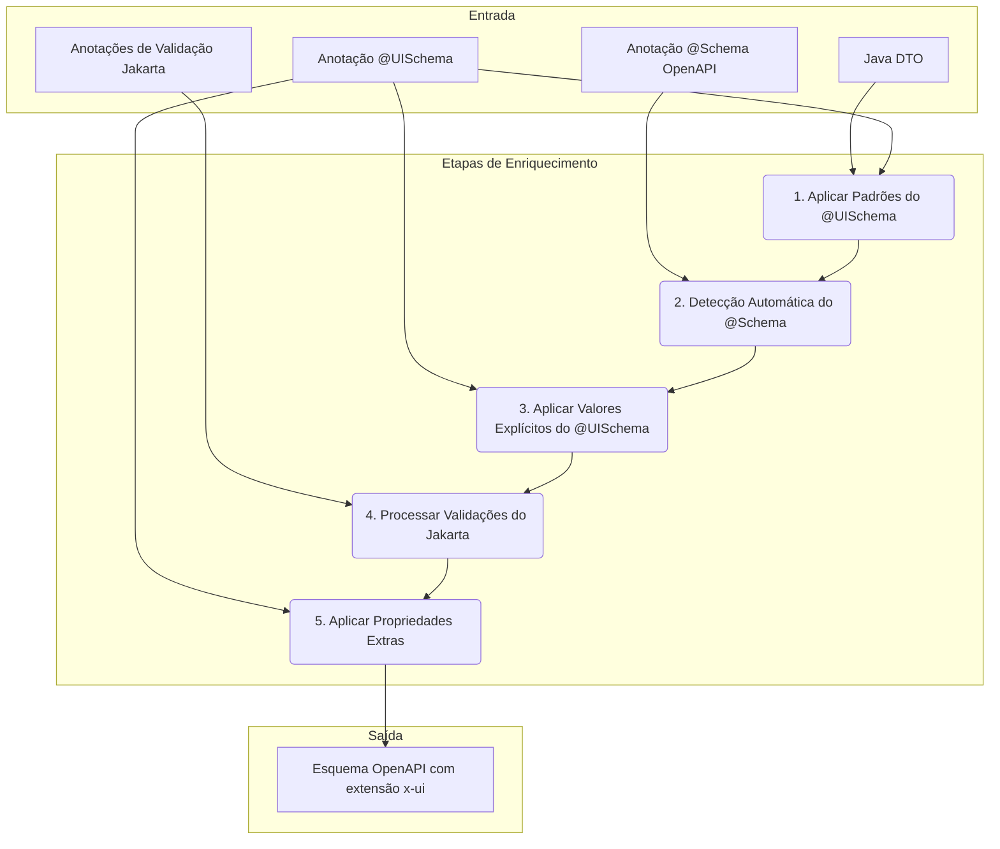
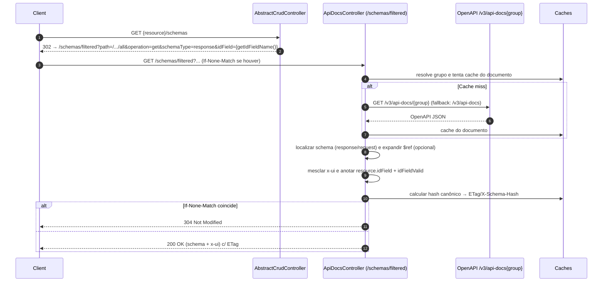

# Praxis Metadata Starter

[](https://central.sonatype.com/artifact/io.github.codexrodrigues/praxis-metadata-starter)
[](https://adoptium.net)
[](https://spring.io/projects/spring-boot)
[](https://github.com/codexrodrigues/praxis-metadata-starter/commits)
[](https://github.com/codexrodrigues/praxis-metadata-starter/actions/workflows/release.yml)
[](https://github.com/codexrodrigues/praxis-metadata-starter/actions/workflows/docs.yml)
[](https://codexrodrigues.github.io/praxis-metadata-starter/)
[](https://www.apache.org/licenses/LICENSE-2.0)

## Introdução

O Praxis Metadata Starter (`praxis-metadata-starter`) é uma biblioteca fundamental para o framework Praxis UI Metadata. Ele permite que os desenvolvedores definam metadados de UI diretamente em seu código de backend, facilitando a geração e configuração automática de componentes de UI, como formulários, tabelas e filtros.

Documentação online (GitHub Pages):
- Site: https://codexrodrigues.github.io/praxis-metadata-starter/
- Javadoc: https://codexrodrigues.github.io/praxis-metadata-starter/apidocs/

### Leituras recomendadas

- [Visão arquitetural detalhada](docs/architecture-overview.md): camadas, fluxos e diagramas Mermaid.
- [Visão dos pacotes Java](docs/packages-overview.md): responsabilidades e classes principais por módulo.
- [Mapa de navegação](docs/sitemap.xml): otimiza indexação por mecanismos de busca e robôs de IA.

### Concept Usage

- Conceitos
  - [Self‑describing APIs](docs/concepts/self-describing-apis.md)
  - [UI Schema vs Data Schema](docs/concepts/ui-schema-vs-data-schema.md)
  - [Metadata‑driven backend‑agnostic](docs/concepts/metadata-driven-backend-agnostic.md)
  - [Configuration‑driven development](docs/concepts/configuration-driven-development.md)
- Técnico
  - [Estratégia de grupos OpenAPI](docs/technical/ESTRATEGIA-DUPLA-GRUPOS-OPENAPI.md)
  - [Auto-configuração](docs/technical/AUTO-CONFIGURACAO.md)
  - [Validação @ApiResource](docs/technical/VALIDACAO-API-RESOURCE.md)
  - [Guia CRUD + Bulk](docs/guides/GUIA-CLAUDE-AI-CRUD-BULK.md)

### Apresentação (artigo)

- Visão geral e exemplos de uso do starter: [APRESENTACAO-BACKEND-METADATA-STARTER.md](APRESENTACAO-BACKEND-METADATA-STARTER.md)
- Índice da documentação do projeto: [docs/README.md](docs/README.md)
- Visão rápida para novos usuários: [docs/overview/VISAO-GERAL.md](docs/overview/VISAO-GERAL.md)

### Principais Recursos

*   **🎯 Resolução Automática de Grupos OpenAPI:** Sistema inteligente que elimina parâmetros manuais, criando grupos específicos baseados nos paths dos controllers (~97% redução de tamanho dos documentos).
*   **🔄 Geração Dinâmica de Esquemas de UI:** Use a anotação `@UISchema` em seus DTOs ou entidades para definir metadados de UI avançados.
*   **🏗️ Infraestrutura CRUD com Auto-Detecção:** Controllers base com detecção automática de paths, eliminando necessidade de implementar `getBasePath()` manualmente.
*   **🔍 Filtragem Dinâmica de Consultas:** Use a anotação `@Filterable` para habilitar campos para geração de consultas JPA dinâmicas e com segurança de tipo.
*   **✅ Integração Automática de Validação:** As anotações de Validação do Jakarta Bean são traduzidas automaticamente em regras de validação de UI.
*   **🔗 Suporte a HATEOAS:** As respostas da API incluem automaticamente links HATEOAS baseados no path detectado automaticamente.
*   **📋 Respostas de API Padronizadas:** Um wrapper `RestApiResponse` consistente é usado para todos os endpoints da API.
*   **📊 Paginação e Ordenação:** Suporte pronto para uso para paginação e ordenação padrão.
*   **💾 Cache Inteligente:** Documentos OpenAPI específicos são cacheados para otimização de performance.

## Primeiros Passos

Para usar o Praxis Metadata Starter, adicione a seguinte dependência ao seu `pom.xml`:

```xml
<dependency>
    <groupId>io.github.codexrodrigues</groupId>
    <artifactId>praxis-metadata-starter</artifactId>
    <version>1.0.0-SNAPSHOT</version>
    <!-- Após publicar o RC: use 1.0.0-rc.1 -->
    <!-- Após a versão final: use 1.0.0 -->
    <!-- Confira a aba Releases para a última versão. -->
  </dependency>
```

Exemplo completo (Quickstart):
- Repositório de exemplo usando o starter em uma aplicação Spring Boot real:
  - https://github.com/codexrodrigues/praxis-api-quickstart

### Release Candidate (RC)

- Para testar a build RC assim que publicada no Central, ajuste a versão no snippet acima para `1.0.0-rc.1`.
- Guia de publicação e processo de release: veja `RELEASING.md`.

## MapStruct Config (Fail‑Fast)

- O `@MapperConfig` corporativo está em `src/main/java/org/praxisplatform/uischema/mapper/config/CorporateMapperConfig.java`.
- Política ativa (Fase 1): `componentModel="spring"` e `unmappedTargetPolicy=ERROR`.
- Como referenciar nos seus `@Mapper`:

```java
import org.mapstruct.Mapper;
import org.praxisplatform.uischema.mapper.config.CorporateMapperConfig;

@Mapper(componentModel = "spring", config = CorporateMapperConfig.class)
public interface MeuMapper { /* ... */ }
```

Observação: não habilitar `unmappedSourcePolicy` ainda (Fase 2 do plano).

## Bean Validation em DTOs (por que e como)

Por que validar na borda (DTOs):
- Falhar mais cedo (400) em vez de na persistência (tarde), reduzindo acoplamento com JPA e custo de ciclo.
- Contrato mais preciso: o OpenAPI reflete `required`, `min/max`, `pattern`, etc.; a UI recebe `x-ui.validation` pronto via `/schemas/filtered`.
- Experiência consistente: mensagens de erro padronizadas em `RestApiResponse.errors` pelo `GlobalExceptionHandler`.

Como aplicar:
- Anotar campos dos DTOs de entrada com `jakarta.validation` (`@NotBlank`, `@NotNull`, `@Size`, `@Pattern`, `@Email`, `@DecimalMin`, `@Past`, etc.).
- Garantir `@Valid` no `@RequestBody` dos endpoints de criação/atualização (controllers que estendem `AbstractCrudController` ou específicos).
- Opcional: usar Grupos (ex.: `Create`, `Update`) quando regras diferirem por operação.
- Em apps Spring Boot, inclua o starter de validação: `org.springframework.boot:spring-boot-starter-validation`.

HTTP e tratamento de erros:
- 400 Bad Request para violações de Bean Validation (estrutura/semântica do payload).
- 422 Unprocessable Entity para regras de negócio/processo (ex.: limites de paginação já aplicados no `AbstractCrudController`).
- O `GlobalExceptionHandler` transforma `MethodArgumentNotValidException` em `RestApiResponse` consistente (categoria VALIDATION).

Integração com x‑ui:
- O `CustomOpenApiResolver` e `OpenApiUiUtils` convertem Bean Validation em `x-ui.validation` automaticamente (required, min/max, pattern, etc.).
- A UI consome via `/schemas/filtered` e ajusta formulários/tabelas dinamicamente.

Exemplos rápidos (DTOs):

```java
import jakarta.validation.constraints.*;

public class EnderecoDTO {
  @NotBlank @Size(max = 120) private String logradouro;
  @NotBlank @Size(max = 80)  private String bairro;
  @NotBlank @Size(max = 120) private String cidade;
  @NotBlank @Size(max = 2)   private String estado;
  @Pattern(regexp = "^\\\d{5}-?\\\d{3}$") private String cep;
}

public class FuncionarioDTO {
  @NotBlank @Size(max = 120) private String nomeCompleto;
  @NotBlank @Pattern(regexp = "^(\\\d{3}\\.\\\d{3}\\.\\\d{3}-\\\d{2}|\\\d{11})$") private String cpf;
  @Past private java.time.LocalDate dataNascimento;
  @Email @Size(max = 160) private String email;
  @NotNull private Long cargoId; @NotNull private Long departamentoId;
  @DecimalMin("0.00") private java.math.BigDecimal salario;
}
```

## Conceitos Principais

O framework é construído em torno de alguns conceitos principais que trabalham juntos para fornecer seus recursos poderosos.

### Arquitetura de Alto Nível

Aqui está uma visão geral de alto nível de como o Praxis Metadata Starter conecta o backend com o frontend:

```mermaid
graph TD
    subgraph Backend
        A[Java DTO com @UISchema]
        B[Validações Jakarta]
    end
    subgraph Starter
        C[CustomOpenApiResolver]
        D[OpenApiGroupResolver]
        E[ApiDocsController]
    end
    subgraph OpenAPI
        F[/v3/api-docs/{group}]
        G[Schema filtrado]
    end
    subgraph Frontend
        H[Aplicação de UI]
        I[Componentes Dinâmicos]
    end

    A --> C;
    B --> C;
    C --> F;
    F --> E;
    E --> G;
    G --> H;
    H --> I;
```

> Diagrama expandido disponível em [docs/architecture-overview.md](docs/architecture-overview.md#fluxo-de-enriquecimento-x-ui).

### Processo de Enriquecimento de Metadados

O processo de enriquecimento é o coração do framework. Ele detecta e aplica automaticamente metadados de UI de várias fontes, seguindo uma ordem clara de precedência.



#### Ordem de Precedência (do menor para o maior)

1.  **Padrões do `@UISchema`:** Os valores padrão da anotação `@UISchema`.
2.  **Detecção Automática de Esquema:** Detecção inteligente com base no tipo e formato do esquema OpenAPI.
3.  **Valores Explícitos do `@UISchema`:** Valores definidos explicitamente pelo desenvolvedor na anotação `@UISchema`.
4.  **Validação do Jakarta:** Regras de validação de anotações como `@NotNull`, `@Size`, etc.
5.  **Propriedades Extras:** Propriedades personalizadas definidas no atributo `extraProperties` do `@UISchema`.

#### Tabela de Detecção Automática

| Tipo OpenAPI | Formato OpenAPI   | Tipo de Controle Detectado | Tipo de Dado Detectado |
|--------------|-------------------|----------------------------|------------------------|
| string       | date              | `date-picker`              | `date`                 |
| string       | date-time         | `date-time-picker`         | `date`                 |
| string       | time              | `time-picker`              | `date`                 |
| string       | email             | `email-input`              | `email`                |
| string       | password          | `password`                 | `password`             |
| string       | uri/url           | `url-input`                | `url`                  |
| string       | binary/byte       | `file-upload`              | `file`                 |
| string       | phone             | `phone`                    | `text`                 |
| string       | color             | `color-picker`             | `text`                 |
| string       | (maxLength > 300) | `textarea`                 | `text`                 |
| number       | currency          | `currency-input`           | `number`               |
| number       | percent           | `numeric-text-box`         | `number`               |
| boolean      | -                 | `checkbox`                 | `boolean`              |
| array        | (itens com enum)  | `multi-select`             | -                      |

### A Anotação `@UISchema`

#### Heurística específica de `controlType` (string)

- `textarea` apenas quando `maxLength > 300`.
- Força `input` por nome: `nome`, `name`, `titulo`, `title`, `assunto`, `subject`.
- Força `textarea` por nome: `descricao`, `observacao`, `description`, `comment`.
- Precedência aplicada ao `controlType`:
  1) Valor explícito em `@UISchema(controlType=...)`
  2) Heurística por nome (apenas sobre INPUT/TEXTAREA do schema)
  3) Detecção por schema (type/format/enum)
  4) Defaults

Mais detalhes: veja docs/concepts/CONTROLTYPE-HEURISTICA.md.

#### Enums, Booleanos, Arrays e Percent

- Enums (string): pequeno (≤5) → `radio`; médio (6–25) → `select`; grande (>25) → `autoComplete`.
- Booleanos: padrão `checkbox` (ou `toggle`); enum textual binária ("Sim/Não") → `radio`.
- Arrays de enums: pequeno → `chipInput`; médios/grandes → `multiSelect` e `filterControlType = multiColumnComboBox` para filtros.
- Percent (`format=percent`): aplica `numericStep=0.01`, `placeholder="0–100%"`, `numericMin=0`, `numericMax=100` (apenas se ausentes).

## Options (OptionDTO)

`OptionDTO<ID>` é uma projeção leve usada por componentes de seleção (combos, auto-complete, multi-select) no frontend. Ela carrega apenas o essencial:

- `id`: identificador da entidade
- `label`: rótulo textual para exibição
- `extra`: dados complementares opcionais (por padrão, `null` para payload leve)

Como o label é resolvido (precedência):

1. `@OptionLabel` no getter ou campo da entidade
2. Heurísticas: `getLabel()`, `getNomeCompleto()`, `getNome()`, `getDescricao()`, `getTitle()`
3. Fallback: `String.valueOf(id)`

Observação de performance:
- A resolução usa reflexão apenas na projeção de opções. Anotar com `@OptionLabel` evita varredura por heurística.

## OptionMapper padrão (fallback inteligente)

Para reduzir boilerplate em Services, o `BaseCrudService` agora fornece um `getOptionMapper()` padrão. Quando não sobrescrito, ele projeta a entidade para `OptionDTO<ID>` usando:

- id: extraído via `extractId(entity)` (invoca `getId()` por reflexão)
- label: calculado por `computeOptionLabel(entity)` com as regras:
  - se houver método ou campo anotado com `@OptionLabel`, usa seu valor
  - senão tenta getters comuns (case-insensitive, primeira ocorrência válida): `getLabel()`, `getNomeCompleto()`, `getNome()`, `getDescricao()`, `getTitle()`
  - se nada encontrado, faz fallback para `String.valueOf(id)`
- extra: `null` (payload leve)

Observações:
- Implementações que já sobrescrevem `getOptionMapper()` continuam funcionando sem mudanças.
- A anotação `@OptionLabel` será descoberta por reflexão mesmo quando estiver em outro módulo.

## @OptionLabel — uso

Declare explicitamente qual propriedade será usada como rótulo das opções:

- Em campo:
  - `@OptionLabel private String nome;`
- Em getter:
  - `@OptionLabel public String getNomeCompleto() { return nomeCompleto; }`

Suporte a herança:
- A anotação pode estar em uma superclasse (campo ou getter); a detecção percorre a cadeia de classes.

## OptionMapper default — como sobrescrever

O `getOptionMapper()` tem implementação default no `BaseCrudService`. Você pode sobrescrevê-lo para customizar `label` ou preencher `extra`:

```java
@Service
class CargoService implements BaseCrudService<Cargo, CargoDTO, Long, CargoFilterDTO> {
  @Override
  public OptionMapper<Cargo, Long> getOptionMapper() {
    return cargo -> new OptionDTO<>(
      cargo.getId(),
      cargo.getNivel() + " - " + cargo.getNome(), // label composto
      Map.of("nivel", cargo.getNivel())            // extra custom
    );
  }
}
```

## Endpoints de opções

Exemplos de chamadas (controllers que estendem `AbstractCrudController`):

- `GET /{resource}/options/by-ids?ids=1,2,3`
- `POST /{resource}/options/filter?page=0&size=10` com body `FilterDTO`

Exemplo de resposta `OptionDTO`:

```json
[
  { "id": 1, "label": "Cargo Sênior", "extra": null },
  { "id": 2, "label": "Cargo Pleno",  "extra": null }
]
```

## Compatibilidade e migração

- Sem breaking change.
- Services existentes permanecem válidos; `getOptionMapper()` custom continua com precedência.
- Em serviços simples, é possível remover mapeadores redundantes e confiar no default.

## Testes

Cobertura adicionada:
- Campo anotado com `@OptionLabel`.
- Getter anotado com `@OptionLabel`.
- Sem anotação (heurísticas) e fallback para `id`.
- Integração com `filterOptions` e `byIdsOptions` (ordem preservada).

## Option label mapping

Para declarar explicitamente qual campo será usado como rótulo das opções, use a anotação `@OptionLabel`:

- Em um campo: `@OptionLabel private String nome;`
- Em um getter: `@OptionLabel public String getNomeCompleto()`

Precedência ao resolver o label na projeção `OptionDTO`:

1. Membro anotado com `@OptionLabel` (getter tem prioridade de busca, depois field)
2. Heurísticas: `getLabel()`, `getNomeCompleto()`, `getNome()`, `getDescricao()`, `getTitle()`
3. Fallback: `String.valueOf(id)`

Sobrescrita opcional:
- Serviços podem customizar completamente a projeção sobrescrevendo `getOptionMapper()` e retornando um `OptionMapper<E, ID>` próprio.


A anotação `@UISchema` é a ferramenta principal para definir metadados de UI. Ela pode ser aplicada a classes e campos.

#### Propriedades do `@UISchema`

Aqui está uma lista completa das propriedades disponíveis na anotação `@UISchema`.

##### Propriedades Básicas

| Propriedade    | Tipo   | Padrão | Descrição                                             |
|----------------|--------|--------|---------------------------------------------------------|
| `name`         | String | `""`   | O nome do campo.                                        |
| `label`        | String | `""`   | O rótulo a ser exibido para o campo.                    |
| `description`  | String | `""`   | Uma descrição do campo.                                 |
| `example`      | String | `""`   | Um valor de exemplo para o campo.                       |
| `placeholder`  | String | `""`   | O texto do placeholder para o campo.                    |
| `defaultValue` | String | `""`   | O valor padrão para o campo.                            |
| `helpText`     | String | `""`   | Um texto de ajuda a ser exibido para o campo.           |
| `hint`         | String | `""`   | Uma dica a ser exibida para o campo.                    |
| `tooltipOnHover` | String | `""` | Uma dica de ferramenta a ser exibida ao passar o mouse sobre o campo. |

*Exemplo:*
```java
@UISchema(
    label = "Campo de Texto",
    placeholder = "Digite o texto",
    defaultValue = "Texto Padrão",
    helpText = "Este é um texto de ajuda"
)
private String textField;
```

##### Tipo e Controle

| Propriedade    | Tipo               | Padrão  | Descrição                                             |
|----------------|--------------------|---------|---------------------------------------------------------|
| `type`         | `FieldDataType`    | `TEXT`  | O tipo de dado do campo.                                |
| `controlType`  | `FieldControlType` | `INPUT` | O tipo de controle de UI a ser usado para o campo.      |

*Exemplo:*
```java
@UISchema(
    label = "Número",
    type = FieldDataType.NUMBER,
    controlType = FieldControlType.NUMERIC_TEXT_BOX
)
private Double numberField;
```

##### Layout e Estilo

| Propriedade          | Tipo    | Padrão  | Descrição                                             |
|----------------------|---------|---------|---------------------------------------------------------|
| `group`              | String  | `""`    | O grupo ao qual o campo pertence.                       |
| `order`              | int     | `0`     | A ordem do campo dentro de seu grupo.                   |
| `width`              | String  | `""`    | A largura do campo.                                     |
| `isFlex`             | boolean | `false` | Se o campo deve usar flexbox.                           |
| `displayOrientation` | String  | `""`    | A orientação de exibição do campo.                      |
| `viewOnlyStyle`      | String  | `""`    | O estilo a ser aplicado quando o campo está no modo somente visualização. |

*Exemplo:*
```java
@UISchema(
    label = "Campo de Texto",
    group = "basico",
    order = 1,
    width = "50%"
)
private String textField;
```

##### Comportamento e Validação

| Propriedade          | Tipo    | Padrão  | Descrição                                             |
|----------------------|---------|---------|---------------------------------------------------------|
| `disabled`           | boolean | `false` | Se o campo deve ser desabilitado.                       |
| `readOnly`           | boolean | `false` | Se o campo deve ser somente leitura.                    |
| `multiple`           | boolean | `false` | Se o campo deve permitir múltiplos valores.             |
| `editable`           | boolean | `true`  | Se o campo deve ser editável.                           |
| `validationMode`     | String  | `""`    | O modo de validação para o campo.                       |
| `unique`             | boolean | `false` | Se o valor do campo deve ser único.                     |
| `mask`               | String  | `""`    | A máscara a ser aplicada ao campo.                      |
| `sortable`           | boolean | `true`  | Se o campo deve ser ordenável.                          |
| `conditionalRequired`| String  | `""`    | Uma condição que torna o campo obrigatório.             |
| `validationTriggers` | String  | `""`    | Os gatilhos para validação.                             |
| `inlineEditing`      | boolean | `false` | Se o campo deve ser editável em linha.                  |
| `transformValueFunction` | String | `""` | Uma função para transformar o valor do campo.           |
| `debounceTime`       | int     | `0`     | O tempo de debounce para o campo.                       |

*Exemplo:*
```java
@UISchema(
    label = "Senha",
    required = true,
    pattern = ValidationPattern.PASSWORD_MEDIUM,
    patternMessage = "A senha deve ser mais forte"
)
private String password;
```

##### Visibilidade

| Propriedade       | Tipo    | Padrão  | Descrição                                             |
|-------------------|---------|---------|---------------------------------------------------------|
| `hidden`          | boolean | `false` | Se o campo deve ser oculto.                             |
| `tableHidden`     | boolean | `false` | Se o campo deve ser oculto em tabelas.                  |
| `formHidden`      | boolean | `false` | Se o campo deve ser oculto em formulários.              |
| `filterable`      | boolean | `false` | Se o campo deve ser filtrável.                          |
| `hiddenCondition` | String  | `""`    | Uma condição que torna o campo oculto.                  |

*Exemplo:*
```java
@UISchema(
    label = "Notas Internas",
    hidden = true,
    formHidden = true
)
private String internalNotes;
```

##### Dependências e Ações Dinâmicas

| Propriedade             | Tipo    | Padrão  | Descrição                                             |
|-------------------------|---------|---------|---------------------------------------------------------|
| `conditionalDisplay`    | String  | `""`    | Uma condição que determina se o campo é exibido.        |
| `dependentField`        | String  | `""`    | O campo do qual este campo depende.                     |
| `resetOnDependentChange`| boolean | `false` | Se o campo deve ser resetado quando o campo dependente muda. |

*Exemplo:*
```java
@UISchema(
    label = "Funções",
    controlType = FieldControlType.MULTI_SELECT,
    dependentField = "status",
    conditionalDisplay = "status == 'ACTIVE'"
)
private List<String> roles;
```

##### Ícones

| Propriedade     | Tipo           | Padrão | Descrição                                             |
|-----------------|----------------|--------|---------------------------------------------------------|
| `icon`          | String         | `""`   | O ícone a ser exibido para o campo.                     |
| `iconPosition`  | `IconPosition` | `LEFT` | A posição do ícone.                                     |
| `iconSize`      | String         | `""`   | O tamanho do ícone.                                     |
| `iconColor`     | String         | `""`   | A cor do ícone.                                         |
| `iconClass`     | String         | `""`   | A classe CSS do ícone.                                  |
| `iconStyle`     | String         | `""`   | O estilo CSS do ícone.                                  |
| `iconFontSize`  | String         | `""`   | O tamanho da fonte do ícone.                            |

*Exemplo:*
```java
@UISchema(
    label = "Campo de Texto",
    icon = "edit",
    iconPosition = IconPosition.LEFT
)
private String textField;
```

##### Opções e Mapeamento

| Propriedade       | Tipo   | Padrão | Descrição                                             |
|-------------------|--------|--------|---------------------------------------------------------|
| `valueField`      | String | `""`   | O nome do campo de valor para as opções.                |
| `displayField`    | String | `""`   | O nome do campo de exibição para as opções.             |
| `endpoint`        | String | `""`   | O endpoint para buscar as opções.                       |
| `emptyOptionText` | String | `""`   | O texto para a opção vazia.                             |
| `options`         | String | `""`   | Uma string JSON de opções.                              |

*Exemplo:*
```java
@UISchema(
    label = "Status",
    controlType = FieldControlType.SELECT,
    options = "[{\"label\":\"Ativo\",\"value\":\"ACTIVE\"},{\"label\":\"Inativo\",\"value\":\"INACTIVE\"}]",
    valueField = "value",
    displayField = "label"
)
private String status;
```

##### Propriedades de Entrada Numérica

| Propriedade        | Tipo            | Padrão    | Descrição                                             |
|--------------------|-----------------|-----------|---------------------------------------------------------|
| `numericFormat`    | `NumericFormat` | `INTEGER` | O formato da entrada numérica.                          |
| `numericStep`      | String          | `""`      | O valor do passo para a entrada numérica.               |
| `numericMin`       | String          | `""`      | O valor mínimo para a entrada numérica.                 |
| `numericMax`       | String          | `""`      | O valor máximo para a entrada numérica.                 |
| `numericMaxLength` | String          | `""`      | O comprimento máximo da entrada numérica.               |

*Exemplo:*
```java
@UISchema(
    label = "Número",
    type = FieldDataType.NUMBER,
    numericFormat = NumericFormat.DECIMAL,
    numericStep = "0.5",
    numericMin = "0",
    numericMax = "100"
)
private Double numberField;
```

##### Propriedades de Validação

| Propriedade         | Tipo                | Padrão   | Descrição                                             |
|---------------------|---------------------|----------|---------------------------------------------------------|
| `required`          | boolean             | `false`  | Se o campo é obrigatório.                               |
| `minLength`         | int                 | `0`      | O comprimento mínimo do campo.                          |
| `maxLength`         | int                 | `0`      | O comprimento máximo do campo.                          |
| `min`               | String              | `""`     | O valor mínimo do campo.                                |
| `max`               | String              | `""`     | O valor máximo do campo.                                |
| `pattern`           | `ValidationPattern` | `CUSTOM` | O padrão de validação para o campo.                     |
| `requiredMessage`   | String              | `""`     | A mensagem a ser exibida quando o campo é obrigatório mas não preenchido. |
| `minLengthMessage`  | String              | `""`     | A mensagem a ser exibida quando o valor do campo é menor que `minLength`. |
| `maxLengthMessage`  | String              | `""`     | A mensagem a ser exibida quando o valor do campo é maior que `maxLength`. |
| `patternMessage`    | String              | `""`     | A mensagem a ser exibida quando o valor do campo não corresponde ao `pattern`. |
| `rangeMessage`      | String              | `""`     | A mensagem a ser exibida quando o valor do campo está fora do intervalo. |
| `customValidator`   | String              | `""`     | O nome de uma função de validador personalizada.        |
| `asyncValidator`    | String              | `""`     | O nome de uma função de validador assíncrona.           |
| `minWords`          | int                 | `0`      | O número mínimo de palavras no campo.                   |
| `allowedFileTypes`  | `AllowedFileTypes`  | `ALL`    | Os tipos de arquivo permitidos para uploads de arquivos. |
| `maxFileSize`       | String              | `""`     | O tamanho máximo do arquivo para uploads de arquivos.   |

*Exemplo:*
```java
@UISchema(
    label = "Descrição",
    controlType = FieldControlType.TEXTAREA,
    maxLength = 500,
    minLength = 10,
    required = true,
    minLengthMessage = "Descrição muito curta",
    maxLengthMessage = "Descrição muito longa"
)
private String description;
```

##### Propriedades Avançadas

| Propriedade       | Tipo                | Padrão | Descrição                                             |
|-------------------|---------------------|--------|---------------------------------------------------------|
| `extraProperties` | `ExtensionProperty[]` | `{}`   | Um array de propriedades extras a serem adicionadas ao esquema de UI. |

*Exemplo:*
```java
@UISchema(
    label = "Cor Favorita",
    controlType = FieldControlType.COLOR_PICKER,
    extraProperties = {
        @ExtensionProperty(name = "x-color-theme", value = "corporate")
    }
)
private String favoriteColor;
```

### A Anotação `@Filterable`

A anotação `@Filterable` marca um campo de DTO como disponível para filtragem em consultas de banco de dados.

*   **`operation()`:** Define a operação de comparação (por exemplo, `EQUAL`, `LIKE`).
*   **`relation()`:** Especifica um caminho para um campo em uma entidade relacionada.

### A Anotação `@DefaultSortColumn`

A anotação `@DefaultSortColumn` define automaticamente a ordenação padrão para consultas JPA quando nenhuma ordenação explícita é fornecida via `Pageable`.

#### 🎯 Objetivo

Elimina a necessidade de especificar ordenação em cada consulta, fornecendo uma ordenação sensata e consistente por padrão para listagens e filtros.

#### 📋 Parâmetros

*   **`ascending`:** `true` = ASC, `false` = DESC (padrão: `true`)
*   **`priority`:** Prioridade da ordenação - menor valor = maior prioridade (padrão: `0`)

#### 🔄 Exemplos de Uso

**Ordenação Simples:**
```java
@Entity
public class Cliente {
    @Id
    private Long id;
    
    @DefaultSortColumn  // Ordenação alfabética por padrão
    private String nome;
}

// Resultado: ORDER BY nome ASC (quando nenhum sort é especificado)
```

**Ordenação Múltipla com Prioridades:**
```java
@Entity
public class Funcionario {
    @DefaultSortColumn(priority = 1, ascending = true)
    private String departamento;
    
    @DefaultSortColumn(priority = 2, ascending = true) 
    private String nomeCompleto;
}

// Resultado: ORDER BY departamento ASC, nomeCompleto ASC
```

**Ordenação por Data (Mais Recente Primeiro):**
```java
@Entity
public class Noticia {
    @DefaultSortColumn(ascending = false)
    private LocalDateTime dataPublicacao;
}

// Resultado: ORDER BY dataPublicacao DESC
```

#### 🔗 Integração com APIs

**Sem parâmetro sort (usa @DefaultSortColumn):**
```
GET /api/funcionarios/all
→ Aplica ordenação: ORDER BY departamento ASC, nomeCompleto ASC
```

**Com parâmetro sort (ignora @DefaultSortColumn):**
```
GET /api/funcionarios/all?sort=salario,desc
→ Aplica ordenação: ORDER BY salario DESC
```

#### ⚡ Aplicação Automática

A ordenação é aplicada automaticamente nos seguintes endpoints:

*   `GET /{resource}/all` - Lista completa sem filtros
*   `POST /{resource}/filter` - Lista filtrada com paginação
*   Qualquer método que use `BaseCrudService.findAll()`

#### 🎯 Benefícios

*   **UX Consistente:** Usuários sempre veem dados organizados de forma lógica
*   **Performance:** Evita scans desnecessários com ordenação inteligente
*   **Zero Configuração:** Funciona automaticamente sem código adicional
*   **Flexível:** Pode ser sobrescrita via parâmetros de requisição

## 🚀 Sistema de Resolução Automática de Grupos OpenAPI (Novo!)

### Visão Geral

O Praxis Metadata Starter agora inclui um sistema revolucionário que **elimina completamente** a necessidade de configuração manual de documentação OpenAPI. O sistema detecta automaticamente controllers, cria grupos específicos e resolve documentação baseada no path da requisição.

### 🎯 Benefícios

- **📊 97% menos dados:** Documentos específicos (~14KB) vs completos (~500KB)
- **⚡ Performance:** Cache inteligente com algoritmo "best match" 
- **🔧 Zero configuração:** Grupos criados automaticamente no startup
- **🎨 Flexibilidade:** Suporte a nomes personalizados via `@ApiGroup`

### 🔄 Como Funciona

```
1. Startup da Aplicação
   ↓
2. DynamicSwaggerConfig escaneia controllers que estendem AbstractCrudController  
   ↓
3. Registra grupos OpenAPI automaticamente baseado nos paths
   ↓
4. ApiDocsController resolve grupos automaticamente nas requisições
   ↓
5. Cache otimizado serve documentos específicos por grupo
```

### 📋 Exemplo Prático

**ANTES** (configuração manual):
```java
@RestController
@RequestMapping("/api/human-resources/funcionarios")
public class FuncionarioController extends AbstractCrudController<...> {
    @Override 
    protected String getBasePath() {
        return "/api/human-resources/funcionarios"; // Manual e propenso a erro
    }
}

// Requisição também manual
GET /schemas/filtered?path=/funcionarios&document=api-human-resources-funcionarios
```

**DEPOIS** (automático):
```java
@ApiResource("/api/human-resources/funcionarios")  // Path direto
@ApiGroup("human-resources")                       // Nome personalizado (opcional)
public class FuncionarioController extends AbstractCrudController<...> {
    // ✅ getBasePath() detectado automaticamente
    // ✅ Grupo OpenAPI criado automaticamente  
    // ✅ Cache otimizado
}

// Requisição simplificada
GET /schemas/filtered?path=/api/human-resources/funcionarios/all
// → Resolve automaticamente grupo "human-resources"
```

### ⚙️ Classes Envolvidas

| Classe | Responsabilidade |
|--------|------------------|
| `DynamicSwaggerConfig` | Escaneia controllers e registra grupos no startup |
| `ApiDocsController` | Resolve grupos automaticamente baseado no path |
| `OpenApiGroupResolver` | Algoritmo "best match" para detectar grupo específico |
| `AbstractCrudController` | Auto-detecção de base path via anotações |

### Classes CRUD Genéricas

A biblioteca fornece classes base para acelerar o desenvolvimento de serviços CRUD com recursos avançados:

*   **`AbstractCrudController`:** Controller genérico com auto-detecção de paths e integração OpenAPI automática.
*   **`AbstractBaseCrudService`:** Serviço genérico que implementa a interface `BaseCrudService`.
*   **`BaseCrudService`:** Interface que define o contrato padrão para operações CRUD.
*   **`DynamicSwaggerConfig`:** Configuração automática de grupos OpenAPI baseada em controllers.
*   **`ApiDocsController`:** Endpoint inteligente para servir documentação específica por grupo.

## 🎯 Guia de Migração para Resolução Automática

### Para Controllers Existentes

Se você já tem controllers que estendem `AbstractCrudController`, a migração é simples:

1. **Remova `getBasePath()` manual:**
```java
// ❌ Remover - não é mais necessário
@Override
protected String getBasePath() {
    return "/api/human-resources/funcionarios"; 
}
```

2. **Use constantes de path (recomendado):**
```java
// ✅ Criar arquivo ApiPaths.java (no projeto da aplicação)
public class ApiPaths {
    public static final String BASE = "/api";
    
    public static final class HumanResources {
        private static final String HR_BASE = BASE + "/human-resources";
        public static final String FUNCIONARIOS = HR_BASE + "/funcionarios";
        public static final String EVENTOS_FOLHA = HR_BASE + "/eventos-folha";
    }
}

// ✅ Usar nos controllers
@ApiResource(ApiPaths.HumanResources.FUNCIONARIOS)
public class FuncionarioController extends AbstractCrudController<...> {
    // Auto-detecção funciona automaticamente
}
```

3. **Opcional - Personalizar nome do grupo:**
```java
@ApiGroup("human-resources")  // Nome personalizado em vez de "api-human-resources-funcionarios"
@ApiResource("/api/human-resources/funcionarios")
public class FuncionarioController extends AbstractCrudController<...> {
}
```

### Para Frontend/Cliente

**ANTES:**
```typescript
// Requisição manual com parâmetro document
const schema = await fetch('/schemas/filtered?path=/funcionarios&document=api-human-resources-funcionarios');
```

**DEPOIS:**
```typescript
// Resolução automática - apenas o path é necessário
const schema = await fetch('/schemas/filtered?path=/api/human-resources/funcionarios/all');
```

### Verificação da Migração

Após migrar, você deve ver logs similares a estes no startup:

```
Controllers qualificados encontrados: 8
Grupo 'api-human-resources-funcionarios' registrado para FuncionarioController
Bean GroupedOpenApi registrado: bean=api_human_resources_funcionarios_ApiGroup, group=api-human-resources-funcionarios
```

## 📚 **Documentação Completa**

Para informações detalhadas sobre implementação, consulte nossa **[documentação organizada](docs/README.md)**:

- 📖 **[Guias de Implementação](docs/guides/)** - Guias completos para CRUD+Bulk e novas aplicações
- 💡 **[Exemplos Práticos](docs/examples/)** - Templates de prompt e casos de uso reais  
- 🔧 **[Documentação Técnica](docs/technical/)** - Detalhes sobre auto-configuração e OpenAPI

## Aplicação de Exemplo

Consulte os guias e exemplos em `docs/guides` e `docs/examples` para ver cenários completos de uso e integrações com o novo sistema de resolução automática de grupos.

Recursos destacados na aplicação de exemplo:
- Controllers usando `@ApiResource` e `@ApiGroup`
- Constantes centralizadas em `ApiPaths.java`
- Demonstração do `ApiDocsController` funcionando automaticamente
- `UiSchemaTestDTO.java` com exemplos de todas as propriedades da anotação `@UISchema`

## Integração HTTP: ETag + If-None-Match (schemaHash)

- Endpoint: `GET /schemas/filtered`
- Retorno: `ResponseEntity<Map<String,Object>>` com cabeçalhos de validação condicional
- Objetivo: evitar transferências desnecessárias quando o payload do schema não mudou

Cabeçalhos e comportamento
- Resposta 200 OK:
  - `ETag: "<schemaHash>"` (forte, baseado no JSON canônico do payload final)
  - `Cache-Control: public, max-age=0, must-revalidate`
  - `Vary: Accept-Encoding` (adicione `Accept-Language`/`X-Tenant` somente se a representação variar por esses cabeçalhos)
- Requisição condicional:
  - Envie `If-None-Match: "<schemaHash local>"`
  - Se igual ao ETag atual, retorna `304 Not Modified` sem body

Query params relevantes
- `path`: path do endpoint no OpenAPI (ex.: `/e2e/all`, `/api/human-resources/funcionarios/all`)
- `operation`: `get` (padrão), `post`, etc.
- `schemaType`: `response` (padrão) ou `request` (para corpo de requisição)
- `includeInternalSchemas`: `true`/`false` (se `true`, expande `$ref` no payload final)

Exemplos (curl)
```
curl -i "http://localhost:8080/schemas/filtered?path=/e2e/with-ref&schemaType=response&includeInternalSchemas=true"

# Requisição condicional com cache local
curl -i -H 'If-None-Match: "<etag-from-previous>"' \
  "http://localhost:8080/schemas/filtered?path=/e2e/with-ref&schemaType=response&includeInternalSchemas=true"
```

Notas de implementação (status)
- Hash/ETag:
  - `SchemaCanonicalizer`: ordena chaves de objetos, preserva arrays (exceto `required`), normaliza números via `stripTrailingZeros()`, sem coerção de strings
  - `SchemaHashUtil`: SHA-256 do JSON canônico
  - `IfNoneMatchUtils`: parser robusto para `If-None-Match` (múltiplos valores, ignora ETags fracas para comparação forte)
- ApiDocsController:
  - Retorna `ResponseEntity` com `ETag` e `304` quando aplicável
  - Expansão de `$ref`: copia o schema referenciado INTEIRO, não apenas `properties`
  - Injeta `x-ui` do nível de operação em `schemaMap["x-ui"]`
  - Anota `x-ui.resource.idField` para o CRUD dinâmico

### x-ui.resource.idField (Primary Key)

- O endpoint `/schemas/filtered` passa a incluir `x-ui.resource.idField` no payload retornado, permitindo ao frontend inferir a chave primária para operações de CRUD e `PraxisTable`.
- Estratégia de resolução no backend (ordem):
  - Se o link HATEOAS incluir `idField` (adicionado automaticamente pelos controllers base), usa-o.
  - Caso contrário, se o schema possuir a propriedade `id`, usa `id`.
  - Fallback conservador: `id`.

Como sobrescrever no recurso
- Quando o identificador não for `id` (ex.: `codigo`), sobrescreva no controller:

```java
@ApiResource("/api/produtos")
public class ProdutoController extends AbstractCrudController<Produto, ProdutoDTO, Long, ProdutoFilterDTO> {
    // ... implementations omitted

    @Override
    protected String getIdFieldName() { return "codigo"; }
}
```

Validação
- O backend adiciona `x-ui.resource.idFieldValid: true|false` e `idFieldMessage` quando o campo não existe nas `properties` do schema, auxiliando troubleshooting.

#### Diagrama: Fluxo de Schemas (Backend)



#### Cheatsheet: /schemas/filtered (parâmetros)

- `path`: caminho da operação, ex.: `/api/.../resource/all` (grid) ou `/api/.../resource/filter` (filtro)
- `operation`: `get` (grid) ou `post` (filtro)
- `schemaType`: `response` (grid) ou `request` (filtro)
- `includeInternalSchemas`: `true|false` (expande `$ref` no payload)
- `idField` (opcional): prioriza anotação do campo PK (injetado via controller base)

Exemplos rápidos

```bash
# Grid (response schema)
curl -i "http://localhost:8080/schemas/filtered?path=/api/tipos-servidor/all&operation=get&schemaType=response"

# Filtro (request schema)
curl -i "http://localhost:8080/schemas/filtered?path=/api/tipos-servidor/filter&operation=post&schemaType=request"

# Condicional (ETag/304)
curl -i -H 'If-None-Match: "<etag>"' \
  "http://localhost:8080/schemas/filtered?path=/api/tipos-servidor/all&operation=get&schemaType=response"
```

Boas práticas no frontend
- Persistir por `schemaId` (`path|operation|schemaType|internal:...`)
- Enviar `If-None-Match` com o hash local e aceitar `304`
- Ao receber `200`, atualizar cache, aplicar `overrides` (se houver) e re-renderizar

## Configuração Rápida (Flags úteis)

- HATEOAS (habilitar/desabilitar links `_links` no envelope):
  - Propriedade: `praxis.hateoas.enabled` (default: `true`)
  - Execução rápida (desabilitado):
    - `java -jar target/praxis-sample-app-1.0.0-SNAPSHOT.jar --praxis.hateoas.enabled=false`
  - Verificação:
    - `curl -s -X POST "http://localhost:8080/api/tipos-token/filter" -H "Content-Type: application/json" -d '{}'`
    - Esperado: resposta `RestApiResponse` sem a chave `_links` no topo; cabeçalho `X-Data-Version` permanece.

## Contribuição

Contribuições são bem-vindas. Por favor, abra uma issue ou envie um pull request no repositório do projeto no GitHub.

## Licença

Este projeto está licenciado sob a Licença Apache 2.0.
## Recursos Read‑Only (Views)

Suporte nativo a recursos somente leitura (ex.: entidades JPA mapeando views com `@Immutable`).

- Controller base: `org.praxisplatform.uischema.controller.base.AbstractReadOnlyController`
- Service base: `org.praxisplatform.uischema.service.base.AbstractReadOnlyService`
- Operações de escrita (POST/PUT/DELETE) retornam 405 e podem ser ocultadas do OpenAPI.
- OpenAPI `/schemas/filtered` enriquecido com:
  - `x-ui.resource.readOnly`: `true|false`
  - `x-ui.resource.capabilities`: `{ create, update, delete, options, byId, all, filter, cursor }`
  - `x-ui.resource.idField`: heurística automática (ver abaixo)

Exemplo:

```java
@ApiResource("/api/reporting/funcionarios-view")
public class FuncionarioViewController extends AbstractReadOnlyController<FuncView, FuncViewDTO, Long, FuncFilterDTO> {
  @Autowired FuncionarioViewService service;
  @Override protected FuncionarioViewService getService() { return service; }
  @Override protected FuncViewDTO toDto(FuncView e) { /* ... */ }
  @Override protected FuncView toEntity(FuncViewDTO d) { /* N/A em read-only */ return null; }
  @Override protected Long getEntityId(FuncView e) { return e.getId(); }
  @Override protected Long getDtoId(FuncViewDTO d) { return d.getId(); }
}
```

Service:

```java
@Service
public class FuncionarioViewService extends AbstractReadOnlyService<FuncView, FuncViewDTO, Long, FuncFilterDTO> {
  public FuncionarioViewService(FuncViewRepository repo) { super(repo, FuncView.class); }
}
```

Heurística de `idField`:
- Controller infere o campo id pela entidade: primeiro campo anotado com `@Id`; fallback: `"id"`.
- `/schemas/filtered` valida o campo no schema do DTO; caso `id` não exista, usa a primeira propriedade terminando com `Id`.
### Filtros — Operações Suportadas

Além de EQUAL/LIKE/IN/BETWEEN/GREATER_THAN/LESS_THAN, o mecanismo suporta:

- NOT_EQUAL, NOT_LIKE, STARTS_WITH, ENDS_WITH
- GREATER_OR_EQUAL, LESS_OR_EQUAL
- NOT_IN
- IS_NULL, IS_NOT_NULL (ativadas quando `Boolean.TRUE` no DTO)

Lote 1 (Core) — adicionais:

- BETWEEN_EXCLUSIVE, NOT_BETWEEN, OUTSIDE_RANGE
- ON_DATE, IN_LAST_DAYS, IN_NEXT_DAYS
- SIZE_EQ, SIZE_GT, SIZE_LT (coleções)
- IS_TRUE, IS_FALSE (booleanos)

Veja exemplos e tabela completa em docs/guides/FILTROS-E-PAGINACAO.md.
