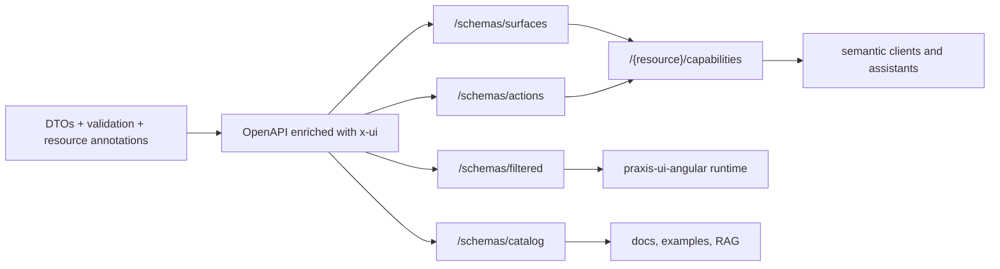

# Praxis Metadata Starter

`praxis-metadata-starter` e a fonte canonica da semantica metadata-driven do backend Praxis.

Ele publica:

- OpenAPI enriquecido com `x-ui`
- `/schemas/filtered` como contrato estrutural consumido pelos runtimes
- `/schemas/catalog` como catalogo documental e de discovery
- `/schemas/domain` como catalogo semantico AI-operable de dominio, evidencias e governanca
- `/schemas/surfaces` e `/schemas/actions` como discovery semantico
- `GET /{resource}/capabilities` e `GET /{resource}/{id}/capabilities` como snapshot agregado
- `POST /{resource}/export` como operacao canonica de exportacao de colecao
- `/praxis/cockpit` como cockpit automatico do host, derivado das superficies metadata-driven existentes
- envelopes `RestApiResponse` com suporte efetivo a Spring HATEOAS

Nao e apenas um gerador de CRUD. O baseline atual da plataforma e:

- `resource`
- `surface`
- `action`
- `capability`
- HATEOAS

## Public Documentation

Use estes entry points primeiro:

- Home: [docs/index.md](docs/index.md)
- Guides hub: [docs/guides/index.md](docs/guides/index.md)
- Architecture overview: [docs/architecture-overview.md](docs/architecture-overview.md)
- Conformance: [docs/spec/CONFORMANCE.md](docs/spec/CONFORMANCE.md)
- Guide 01 - Application setup: [docs/guides/GUIA-01-AI-BACKEND-APLICACAO-NOVA.md](docs/guides/GUIA-01-AI-BACKEND-APLICACAO-NOVA.md)
- Guide 02 - Canonical resource backend: [docs/guides/GUIA-02-AI-BACKEND-CRUD-METADATA.md](docs/guides/GUIA-02-AI-BACKEND-CRUD-METADATA.md)
- Semantic metadata authoring: [docs/guides/SEMANTIC-METADATA-AUTHORING.md](docs/guides/SEMANTIC-METADATA-AUTHORING.md)
- Options and option-sources: [docs/guides/OPTIONS-ENDPOINT.md](docs/guides/OPTIONS-ENDPOINT.md)
- Guide 04 - When to use resource, surface, action, capability: [docs/guides/GUIA-04-QUANDO-USAR-RESOURCE-SURFACE-ACTION-CAPABILITY.md](docs/guides/GUIA-04-QUANDO-USAR-RESOURCE-SURFACE-ACTION-CAPABILITY.md)
- GitHub Pages site: [https://codexrodrigues.github.io/praxis-metadata-starter/](https://codexrodrigues.github.io/praxis-metadata-starter/)
- Public Javadoc: [https://codexrodrigues.github.io/praxis-metadata-starter/apidocs/](https://codexrodrigues.github.io/praxis-metadata-starter/apidocs/)
- Assisted repository exploration (complementary, not normative): [CodeWiki](https://codewiki.google/github.com/codexrodrigues/praxis-metadata-starter/)

## What The Starter Actually Publishes

### Structural contract

`/schemas/filtered` continua sendo a superficie estrutural canonica.

Ela entrega:

- propriedades com `properties.*.x-ui`
- `x-ui.resource.idField`
- `x-ui.resource.readOnly`
- `x-ui.resource.capabilities`
- metadata de operacao
- `ETag` e `X-Schema-Hash`

### Documentary contract

`/schemas/catalog` nao substitui o contrato estrutural. Ele publica:

- resumo de operacoes
- exemplos request/response
- links canonicos para schemas estruturais
- material para docs, tooling e RAG

### Semantic discovery

O baseline atual adiciona discovery orientado a recurso:

- `GET /schemas/domain`
- `GET /schemas/surfaces`
- `GET /schemas/actions`
- `GET /{resource}/capabilities`
- `GET /{resource}/{id}/capabilities`
- `POST /{resource}/export`
- `GET /praxis/cockpit`

O cockpit e empacotado pelo starter em `META-INF/resources/praxis/cockpit`.
Hosts com politica propria de Spring Security devem permitir `GET /praxis/cockpit`,
`GET /praxis/cockpit/` e `GET /praxis/cockpit/**`; o `praxis-api-quickstart`
e a referencia operacional dessa exposicao.

Regras importantes:

- `surfaces` e `actions` sao catalogos semanticos; nao redefinem schema inline
- surfaces relacionadas podem publicar `relatedResource` para explicitar colecao filha, binding com o item pai, selecao e operacoes da colecao filha
- `domain` agrega vocabulario, aliases, evidencias e governanca derivados de fontes canonicas
- `capabilities` agrega o que existe agora sem virar uma segunda fonte de verdade do contrato
- ausencia em `actions` e `capabilities` nao tem a mesma semantica
- exportacao e uma operacao de colecao; o request preserva escopo, selecao, filtros, ordenacao, campos e limites

### Governanca semantica de dominio

`@DomainGovernance` declara classificacao semantica e politica de uso por IA em
campos de DTOs publicados pelo starter.

Fluxo canonico:

- o codigo-fonte declara `@DomainGovernance`
- o resolver OpenAPI materializa `x-domain-governance` no schema do campo
- `/schemas/domain` republica a governanca como item auditavel ligado ao campo

O contrato Java usa enums publicos para evitar drift de tokens:

- `DomainGovernanceKind`: `privacy`, `security`, `compliance`
- `DomainClassification`: `public`, `internal`, `confidential`, `restricted`
- `DomainDataCategory`: `credential`, `sensitive_personal`, `personal`, `financial`, `operational`, `legal`
- `AiUsageMode`: `allow`, `deny`, `mask`, `review_required`, `summarize_only`

Quando a anotacao nao existir, o catalogo pode aplicar heuristicas de fallback.
Para hosts e exemplos self-describing, a declaracao explicita deve ser preferida.

### Acesso contextual em nivel de campo

`@UISchema` pode publicar `x-ui.fieldAccess` para declarar authorities requeridas
para leitura ou edicao de campos corporativos. Essas authorities usam o mesmo
vocabulario declarativo das surfaces/actions; elas nao sao automaticamente iguais
ao bloco `capabilities` de runtime, a menos que o host publique esse mapeamento de
forma explicita.

Exemplo:

```java
@UISchema(
    visibleForAuthorities = {"payroll.read", "payroll.admin"},
    editableForAuthorities = {"payroll.admin"},
    fieldAccessReason = "Dados salariais restritos por politica corporativa."
)
private BigDecimal salario;
```

Esse bloco orienta runtimes metadata-driven e assistentes de IA sobre a politica
esperada, mas nao substitui a autorizacao do host. O backend consumidor deve aplicar
a mesma politica em services, validators ou filtros de seguranca antes de retornar ou
persistir dados sensiveis. `fieldAccessReason` explica a politica para auditoria e
UX, mas nao define acesso sozinho; ao menos uma lista de authorities deve existir
quando `x-ui.fieldAccess` for publicado.

### Authoring semantico de metadata

`@UISchema(preset = ...)` acelera metadados repetitivos de apresentacao, como codigo,
status, valor monetario, booleano, documento legal, tenant e timestamp de auditoria.

O preset:

- publica `x-ui.presentationPreset`
- pode preencher `type`, `controlType`, `width`, `icon`, `numericFormat` e metadados visuais similares
- nao gera `@Schema(description=...)`
- nao substitui `@DomainGovernance`
- nao corrige fronteira errada entre DTO publico, comando, filtro ou contexto privado

Use `SemanticMetadataReviewer` em testes, IDEs ou agentes para listar campos que ainda precisam de
documentacao humana de dominio. O reviewer aponta descricoes ausentes, descricoes copiadas do label,
texto derivado de camelCase e campos como `tenantId`, `userId` ou `sessionId` publicados sem governanca.

### `capabilities.operations` como semantica minima canonica

Para o baseline novo de CRUD inferido no frontend oficial, `capabilities` precisa expor um bloco operacional minimo por acao canonica.

Shape esperado por operacao:

- `supported`
- `scope`
- `preferredMethod`
- `preferredRel`
- `availability`

Operacoes canonicas esperadas:

- `create`
- `view`
- `edit`
- `delete`
- `duplicate-draft`, quando o recurso publicar suporte explicito para preparar rascunho editavel sem persistir dados

Papel de cada camada:

- `capabilities.operations` governa se a operacao existe agora e como ela deve ser tratada semanticamente
- `/schemas/filtered` continua sendo a fonte estrutural de request/response schema
- `surfaces` e `actions` continuam sendo discovery semantico rico quando publicados
- `_links` entram como camada operacional/contextual para escolher o target real de execucao
- `ResourceOperationAvailabilityProvider` permite ao host aplicar disponibilidade dinamica de operacoes canonicas sem vazar guards legados, tenant, sessao ou permissao privada

Em outras palavras:

- `capabilities` nao substitui schema
- `capabilities` nao deve carregar schema inline
- `capabilities` governa operacao; schema continua vindo do contrato estrutural e dos catalogos semanticos
- `_links` devem permanecer coerentes com `capabilities.operations.*.availability`

### Regras de delete canonico

`delete` canônico do recurso precisa permanecer semanticamente separado de outros usos de HTTP `DELETE`.

Regras de plataforma:

- `operations.delete` representa delete canônico item-level do recurso
- `DELETE /batch` nao deve promover `operations.delete` item-level
- workflow actions de negocio com verbo HTTP `DELETE` nao devem contaminar o delete canônico
- `delete` canônico normalmente nao exige schema; ele exige suporte, escopo e target operacional validos

Isso evita que clientes metadata-driven confundam:

- exclusao de um item do recurso
- comando destrutivo de negocio
- operacao em lote

### Exportacao canonica de colecao

`POST /{resource}/export` e a superficie backend canonica consumida por componentes como Table e List.

O request publica o estado de colecao necessario para uma exportacao correta:

- `format`: `csv`, `json`, `excel`, `pdf` ou `print`
- `scope`: `auto`, `selected`, `filtered`, `currentPage` ou `all`
- `selection`: chaves selecionadas, chave identificadora, selecao de todos os resultados e exclusoes
- `filters`, `sort`, `pagination` e `query`
- `fields`, `includeHeaders`, `applyFormatting`, `maxRows` e `fileName`
- `formatOptions` e `localization` para materializacao governada por formato/locale

A base `AbstractResourceQueryController` publica o endpoint e delega para
`BaseResourceQueryService.exportCollection(...)`. A implementacao padrao retorna `501 Not Implemented`;
recursos que suportam exportacao devem sobrescrever o metodo no servico e retornar `CollectionExportResult`
com `status`, `format`, `scope` e o artefato produzido. Para exportacoes pequenas, `status=completed`
retorna bytes inline com nome de arquivo, content type e, opcionalmente, `rowCount`. Para exportacoes
corporativas grandes, `status=deferred` retorna `202 Accepted` em JSON com `downloadUrl`, `jobId`,
`warnings` e `metadata` para filas, retencao e governanca do host.

Limites publicados em `CollectionExportCapability` devem ser tratados como politica do servidor, nao
como preferencia do cliente. Quando uma exportacao inline for limitada ou truncada, o controller pode
propagar metadados operacionais em headers como `X-Export-Truncated`, `X-Export-Max-Rows`,
`X-Export-Candidate-Row-Count` e `X-Export-Warnings`. Campos solicitados que nao pertencem ao allowlist
exportavel do recurso devem falhar com erro claro, em vez de cair silenciosamente para todos os campos
padrao.

Quando um recurso suportar exportacao, ele pode publicar `CollectionExportCapability` no servico. O snapshot
`GET /{resource}/capabilities` entao preenche `operations.export` com os formatos, escopos, limites e modo
sincrono/assincrono realmente disponiveis:

```json
{
  "operations": {
    "export": {
      "supported": true,
      "scope": "COLLECTION",
      "preferredMethod": "POST",
      "preferredRel": "export",
      "formats": ["csv", "json"],
      "scopes": ["auto", "selected", "filtered", "currentPage", "all"],
      "maxRows": {
        "csv": 500,
        "json": 500
      },
      "async": false
    }
  }
}
```

O starter tambem publica uma SPI reutilizavel para recursos que querem manter a responsabilidade
local apenas sobre consulta, permissao e campos:

- `CollectionExportExecutor`: resolve o engine pelo `format` solicitado e monta o `CollectionExportResult`
- `CollectionExportEngine`: contrato de serializacao por formato
- `CsvCollectionExportEngine`: engine padrao para CSV com headers opcionais e protecao contra formula injection
- `JsonCollectionExportEngine`: engine padrao para JSON tabular preservando a ordem dos campos
- `CollectionExportValueResolver`: funcao do recurso para mapear linha + campo em valor exportavel

`applyFormatting=true` usa a apresentacao serializavel declarada em
`CollectionExportFieldPresentation` e o contexto de `localization`. Para CSV
compativel com Excel, use `formatOptions.csv` com delimitador `;`, UTF-8/BOM e
CRLF quando o consumidor alvo exigir esse dialeto. Isso continua sendo CSV; o
formato `excel` so deve aparecer em capabilities quando existir engine XLSX real.

Os formatos `excel`, `pdf` e `print` permanecem no contrato publico para que consumidores possam expressar
a intencao, mas exigem engine registrado pelo host ou por versao futura do starter. Na ausencia de engine,
o executor rejeita o formato com `400 Bad Request` pela mesma trilha de validacao do endpoint base.

## Canonical Backend Baseline

O baseline canonico para recursos metadata-driven e:

- `AbstractResourceController`
- `AbstractCreateUpdateResourceController`, quando o recurso publica create/update sem delete
- `AbstractLegacyBackedResourceController`, quando a escrita for delegada a backend legado mantendo contrato publico resource-oriented
- `AbstractDuplicateDraftLegacyBackedResourceController`, somente quando o recurso realmente publicar `POST /{resource}/{id}/duplicate-draft` como rascunho nao mutante
- `AbstractReadOnlyResourceController`
- `AbstractBaseResourceService`
- `AbstractReadOnlyResourceService`
- `BaseCreateUpdateResourceService`, quando a porta de comando publica create/update sem delete
- `LegacyBackedResourceService`, quando create/update/delete forem executados por porta/adaptador do host
- `DuplicateDraftLegacyBackedResourceService`, quando `duplicate-draft` preparar um DTO editavel para posterior `POST`
- `ResourceMapper`
- `@ApiResource(value = ..., resourceKey = ...)`

Adote DTOs separados:

- `ResponseDTO`
- `CreateDTO`
- `UpdateDTO`
- `DraftDTO`, quando `duplicate-draft` precisar retornar um rascunho diferente do `ResponseDTO`
- `FilterDTO`

Use `@UiSurface` quando a UX precisa descobrir semanticamente uma experiencia real.

Para colecoes relacionadas ao item atual, publique uma surface `ITEM` sobre a operacao real e preencha
os campos `related*` da anotacao:

- `relatedChildResourceKey`
- `relatedChildResourcePath`
- `relatedChildParentField`
- `relatedSelectable`
- `relatedSelectionKeyField`
- `relatedChildOperations`

O starter materializa esses campos em `relatedResource` dentro de `/schemas/surfaces` e de
`GET /{resource}/{id}/surfaces`. Isso permite que o runtime monte listas filhas, selecao e comandos
da colecao relacionada sem mapa local de frontend. O payload continua vindo da operacao HTTP real e o
schema continua resolvido por `/schemas/filtered`.

`relatedResource` e um bloco atomico: quando uma surface publicar metadado de colecao filha, ela deve
informar `relatedChildResourceKey`, `relatedChildResourcePath` e `relatedChildParentField`. Liste em
`relatedChildOperations` apenas operacoes com endpoint HTTP real no recurso filho ou no controller
relacionado; o starter nao deve anunciar CREATE/DELETE apenas como desejo de UX.

Use `@WorkflowAction` quando a operacao for um comando de negocio explicito.

### Related Resource Controllers

Recursos relacionados podem ser publicados por controller customizado quando a experiencia nao deve virar
um recurso raiz artificial. Nesse caso, o controller precisa declarar a identidade documental usada pelos
grupos OpenAPI do starter:

- `@ApiGroup("<grupo-do-dominio>")`
- `@RequestMapping("<path-base-do-recurso-pai>")`
- mappings de metodo relativos ao recurso pai, como `@PostMapping("/{parentId}/certifications")`

Exemplo:

```java
@RestController
@ApiGroup("human-resources")
@RequestMapping("/api/hr/employees")
class EmployeeCertificationController {

    @PostMapping("/{employeeId}/certifications")
    ResponseEntity<RestApiResponse<CertificationDTO>> create(
            @PathVariable Long employeeId,
            @Valid @RequestBody CertificationCommandDTO command
    ) {
        // ...
    }
}
```

Com essa modelagem, o path relacionado entra no documento de grupo correto e continua resolvivel por
`/schemas/filtered?path=/api/hr/employees/{employeeId}/certifications&operation=post&schemaType=request`.
Nao crie endpoint raiz apenas para satisfazer discovery de schema.

## What `resourceKey` Actually Means

`resourceKey` e a identidade semantica estavel do recurso na plataforma.

Diferenca pratica:

- `path` ou `resourcePath` diz onde o endpoint vive, por exemplo `/api/human-resources/employees`
- `resourceKey` diz o que o recurso e para discovery e agregacao, por exemplo `human-resources.employees`

Regra de plataforma:

- o `path` pode mudar por reorganizacao de URL, proxy, versionamento ou host
- o `resourceKey` nao deve mudar apenas porque a URL mudou

No starter, `resourceKey` e usado para:

- resolver `GET /schemas/surfaces?resource={resourceKey}`
- resolver `GET /schemas/actions?resource={resourceKey}`
- agregar `GET /{resource}/capabilities` e `GET /{resource}/{id}/capabilities`
- indexar availability contextual de surfaces e actions

Por isso, `@ApiResource(value = ..., resourceKey = ...)` nao e so decoracao. Ele define:

- a URL operacional do recurso
- a identidade semantica que o restante da plataforma usa para discovery

## Spring HATEOAS Is Part Of The Contract

O starter usa HATEOAS de forma efetiva, nao ornamental.

Isso aparece em:

- `_links` no envelope `RestApiResponse`
- links para self e operacoes canonicas nos controllers base
- discovery contextual em recursos item-level
- integracao entre semantica de recurso e navegacao HTTP

Quando `praxis.hateoas.enabled=false`, a semantica de links e suprimida do envelope, mas o contrato estrutural de schema continua existindo.

## Quick Mental Model


```mermaid
flowchart LR
  dto["DTOs + validation + resource annotations"] --> openapi["OpenAPI enriched with x-ui"]
  openapi --> filtered["/schemas/filtered"]
  openapi --> catalog["/schemas/catalog"]
  openapi --> surfaces["/schemas/surfaces"]
  openapi --> actions["/schemas/actions"]
  surfaces --> caps["/{resource}/capabilities"]
  actions --> caps
  filtered --> runtime["praxis-ui-angular runtime"]
  catalog --> docs["docs, examples, RAG"]
  caps --> clients["semantic clients and assistants"]
```

## First Steps

1. Adicione a dependencia Maven.
2. Siga [docs/guides/GUIA-01-AI-BACKEND-APLICACAO-NOVA.md](docs/guides/GUIA-01-AI-BACKEND-APLICACAO-NOVA.md).
3. Modele o primeiro recurso com `@ApiResource(value = ..., resourceKey = ...)`.
4. Valide `/schemas/filtered`, `/schemas/catalog`, `/schemas/surfaces`, `/schemas/actions`, `GET /{resource}/capabilities` e `GET /{resource}/{id}/capabilities`.
5. Se o recurso publicar `OptionSourceRegistry`, valide tambem `POST /{resource}/option-sources/{sourceKey}/options/filter` e `GET /{resource}/option-sources/{sourceKey}/options/by-ids`.
6. Integre o host oficial com `praxis-ui-angular`.

Dependencia minima:

```xml
<dependency>
  <groupId>io.github.codexrodrigues</groupId>
  <artifactId>praxis-metadata-starter</artifactId>
  <version>8.0.0-rc.17</version>
</dependency>
```

## Public Endpoints To Validate

Para um recurso mutavel no baseline atual, valide no minimo:

- `GET /v3/api-docs/{group}`
- `GET /schemas/filtered`
- `GET /schemas/catalog`
- `GET /schemas/surfaces?resource={resourceKey}`
- `GET /schemas/actions?resource={resourceKey}` quando houver `@WorkflowAction`
- `GET /{resource}/capabilities`
- `GET /{resource}/{id}/capabilities`
- `POST /{resource}/export` quando o recurso suportar exportacao

Quando o frontend oficial for consumir CRUD inferido, valide tambem no payload de `capabilities`:

- `operations.create.supported`
- `operations.create.scope`
- `operations.create.preferredMethod`
- `operations.create.preferredRel`
- `operations.view.supported`
- `operations.edit.supported`
- `operations.delete.supported`
- `operations.delete.scope`
- `operations.delete.preferredMethod`

Para `delete`, confira explicitamente:

- item-level real publica `operations.delete.scope = ITEM`
- um endpoint `DELETE /batch` isolado nao promove `operations.delete`
- workflow `DELETE` continua em `actions`, nao redefine `operations.delete`

Quando houver discovery `ITEM`, valide tambem:

- `GET /{resource}/{id}/surfaces`
- `GET /{resource}/{id}/actions`
- `responseCardinality` das surfaces de leitura item-level, especialmente quando a operacao
  projeta colecoes relacionadas como historicos, eventos, participantes ou linhas analiticas
- `relatedResource.childResourceKey`, `childResourcePath`, `childParentField`, `selectable`,
  `selectionKeyField` e `childOperations` quando a surface publicar uma colecao filha relacionada

Quando o recurso publicar `OptionSourceRegistry`, valide tambem:

- `POST /{resource}/option-sources/{sourceKey}/options/filter`
- `GET /{resource}/option-sources/{sourceKey}/options/by-ids`
- `x-ui.optionSource` em `/schemas/filtered` para os campos governados por essa source
- `filterEndpoint`, `byIdsEndpoint`, `selectedReloadPolicy` e `invalidSortPolicy` no metadata emitido
- `sourceKey` URL-safe, usando letras, numeros, ponto, underscore ou hifen, porque ele compoe endpoints publicos de runtime
- quando `RESOURCE_ENTITY` publicar `filtering`, valide tambem `availableFilters`, `defaultFilters`, `sortOptions` e `defaultSort` no schema emitido

Para lookups corporativos provider-backed, prefira `GovernedOptionSourceCatalog.providerBackedLookup(...)`
em vez de remontar manualmente `OptionSourceDescriptor` em cada service. O builder preserva o registry
canonico existente e apenas materializa endpoints, dependency mapping, reload por IDs e politica de sort
como contrato publico de runtime.

## Internal OpenAPI Base Resolution

Os endpoints internos que consultam o SpringDoc, como `/schemas/filtered`, `/schemas/catalog`, `/schemas/surfaces` e `/schemas/actions`, resolvem a base do OpenAPI nesta ordem:

1. `app.openapi.internal-base-url`
2. contexto HTTP atual

Use isso quando a aplicacao estiver atras de proxy ou numa plataforma em que a URL publica nao coincide com a origem interna do processo Java.

Exemplo:

```properties
app.openapi.internal-base-url=http://localhost:4003
```

## Read-only Resources

Read-only continua sendo um caso de primeira classe:

- controller: `AbstractReadOnlyResourceController`
- service: `AbstractReadOnlyResourceService`
- `x-ui.resource.readOnly=true`
- HATEOAS e discovery coerentes com o contrato publicado

Nao crie um contrato paralelo de read-only para contornar o baseline canonico.

## Documentation Positioning

Este README descreve apenas a superficie publica atual do starter.

Para onboarding, modelagem e validacao, siga os entry points documentados neste arquivo e em `docs/`.

## References

- Architecture overview: [docs/architecture-overview.md](docs/architecture-overview.md)
- Package map: [docs/packages-overview.md](docs/packages-overview.md)
- Guides hub: [docs/guides/index.md](docs/guides/index.md)
- Conformance: [docs/spec/CONFORMANCE.md](docs/spec/CONFORMANCE.md)
