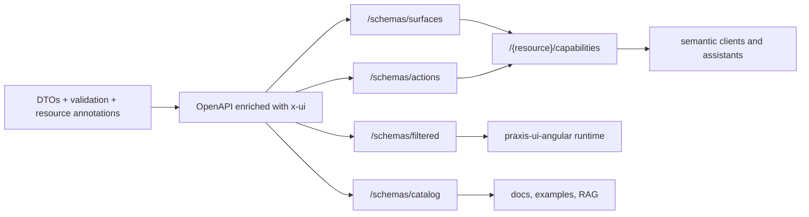

# Praxis Metadata Starter

`praxis-metadata-starter` e a fonte canonica da semantica metadata-driven do backend Praxis.

Ele publica:

- OpenAPI enriquecido com `x-ui`
- `/schemas/filtered` como contrato estrutural consumido pelos runtimes
- `/schemas/catalog` como catalogo documental e de discovery
- `/schemas/surfaces` e `/schemas/actions` como discovery semantico
- `GET /{resource}/capabilities` e `GET /{resource}/{id}/capabilities` como snapshot agregado
- envelopes `RestApiResponse` com suporte efetivo a Spring HATEOAS

Nao e apenas um gerador de CRUD. O baseline atual da plataforma e:

- `resource`
- `surface`
- `action`
- `capability`
- HATEOAS

## Public Documentation

Use estes entry points primeiro:

- Home: [docs/index.md](docs/index.md)
- Guides hub: [docs/guides/index.md](docs/guides/index.md)
- Architecture overview: [docs/architecture-overview.md](docs/architecture-overview.md)
- Conformance: [docs/spec/CONFORMANCE.md](docs/spec/CONFORMANCE.md)
- Guide 01 - Application setup: [docs/guides/GUIA-01-AI-BACKEND-APLICACAO-NOVA.md](docs/guides/GUIA-01-AI-BACKEND-APLICACAO-NOVA.md)
- Guide 02 - Canonical resource backend: [docs/guides/GUIA-02-AI-BACKEND-CRUD-METADATA.md](docs/guides/GUIA-02-AI-BACKEND-CRUD-METADATA.md)
- Guide 04 - When to use resource, surface, action, capability: [docs/guides/GUIA-04-QUANDO-USAR-RESOURCE-SURFACE-ACTION-CAPABILITY.md](docs/guides/GUIA-04-QUANDO-USAR-RESOURCE-SURFACE-ACTION-CAPABILITY.md)
- GitHub Pages site: [https://codexrodrigues.github.io/praxis-metadata-starter/](https://codexrodrigues.github.io/praxis-metadata-starter/)
- Public Javadoc: [https://codexrodrigues.github.io/praxis-metadata-starter/apidocs/](https://codexrodrigues.github.io/praxis-metadata-starter/apidocs/)

## What The Starter Actually Publishes

### Structural contract

`/schemas/filtered` continua sendo a superficie estrutural canonica.

Ela entrega:

- propriedades com `properties.*.x-ui`
- `x-ui.resource.idField`
- `x-ui.resource.readOnly`
- `x-ui.resource.capabilities`
- metadata de operacao
- `ETag` e `X-Schema-Hash`

### Documentary contract

`/schemas/catalog` nao substitui o contrato estrutural. Ele publica:

- resumo de operacoes
- exemplos request/response
- links canonicos para schemas estruturais
- material para docs, tooling e RAG

### Semantic discovery

O baseline atual adiciona discovery orientado a recurso:

- `GET /schemas/surfaces`
- `GET /schemas/actions`
- `GET /{resource}/capabilities`
- `GET /{resource}/{id}/capabilities`

Regras importantes:

- `surfaces` e `actions` sao catalogos semanticos; nao redefinem schema inline
- `capabilities` agrega o que existe agora sem virar uma segunda fonte de verdade do contrato
- ausencia em `actions` e `capabilities` nao tem a mesma semantica

## Canonical Backend Baseline

Para aplicacoes novas, o baseline correto nao e mais `AbstractCrudController`.

Prefira:

- `AbstractResourceController`
- `AbstractReadOnlyResourceController`
- `AbstractBaseResourceService`
- `AbstractReadOnlyResourceService`
- `ResourceMapper`
- `@ApiResource(value = ..., resourceKey = ...)`

Adote DTOs separados:

- `ResponseDTO`
- `CreateDTO`
- `UpdateDTO`
- `FilterDTO`

Use `@UiSurface` quando a UX precisa descobrir semanticamente uma experiencia real.

Use `@WorkflowAction` quando a operacao for um comando de negocio explicito.

## Spring HATEOAS Is Part Of The Contract

O starter usa HATEOAS de forma efetiva, nao ornamental.

Isso aparece em:

- `_links` no envelope `RestApiResponse`
- links para self e operacoes canonicas nos controllers base
- discovery contextual em recursos item-level
- integracao entre semantica de recurso e navegacao HTTP

Quando `praxis.hateoas.enabled=false`, a semantica de links e suprimida do envelope, mas o contrato estrutural de schema continua existindo.

## Quick Mental Model


```mermaid
flowchart LR
  dto["DTOs + validation + resource annotations"] --> openapi["OpenAPI enriched with x-ui"]
  openapi --> filtered["/schemas/filtered"]
  openapi --> catalog["/schemas/catalog"]
  openapi --> surfaces["/schemas/surfaces"]
  openapi --> actions["/schemas/actions"]
  surfaces --> caps["/{resource}/capabilities"]
  actions --> caps
  filtered --> runtime["praxis-ui-angular runtime"]
  catalog --> docs["docs, examples, RAG"]
  caps --> clients["semantic clients and assistants"]
```

## First Steps

1. Adicione a dependencia Maven.
2. Siga [docs/guides/GUIA-01-AI-BACKEND-APLICACAO-NOVA.md](docs/guides/GUIA-01-AI-BACKEND-APLICACAO-NOVA.md).
3. Modele o primeiro recurso com `@ApiResource(value = ..., resourceKey = ...)`.
4. Valide `/schemas/filtered`, `/schemas/catalog`, `/schemas/surfaces`, `/schemas/actions`, `GET /{resource}/capabilities` e `GET /{resource}/{id}/capabilities`.
5. Integre o host oficial com `praxis-ui-angular`.

Dependencia minima:

```xml
<dependency>
  <groupId>io.github.codexrodrigues</groupId>
  <artifactId>praxis-metadata-starter</artifactId>
  <version>5.0.0-rc.2</version>
</dependency>
```

## Public Endpoints To Validate

Para um recurso mutavel no baseline atual, valide no minimo:

- `GET /v3/api-docs/{group}`
- `GET /schemas/filtered`
- `GET /schemas/catalog`
- `GET /schemas/surfaces?resource={resourceKey}`
- `GET /schemas/actions?resource={resourceKey}` quando houver `@WorkflowAction`
- `GET /{resource}/capabilities`
- `GET /{resource}/{id}/capabilities`

Quando houver discovery `ITEM`, valide tambem:

- `GET /{resource}/{id}/surfaces`
- `GET /{resource}/{id}/actions`

## Internal OpenAPI Base Resolution

Os endpoints internos que consultam o SpringDoc, como `/schemas/filtered`, `/schemas/catalog`, `/schemas/surfaces` e `/schemas/actions`, resolvem a base do OpenAPI nesta ordem:

1. `app.openapi.internal-base-url`
2. contexto HTTP atual

Use isso quando a aplicacao estiver atras de proxy ou numa plataforma em que a URL publica nao coincide com a origem interna do processo Java.

Exemplo:

```properties
app.openapi.internal-base-url=http://localhost:4003
```

## Read-only Resources

Read-only continua sendo um caso de primeira classe:

- controller: `AbstractReadOnlyResourceController`
- service: `AbstractReadOnlyResourceService`
- `x-ui.resource.readOnly=true`
- HATEOAS e discovery coerentes com o contrato publicado

Nao crie um contrato paralelo de read-only para contornar o baseline canonico.

## Legacy Positioning

O projeto ainda contem material historico sobre `AbstractCrudController`, `BaseCrudService` e onboarding CRUD antigo.

Esse material deve ser lido como referencia de migracao e legado, nao como baseline para aplicacoes novas.

Se houver divergencia entre README antigo, exemplos antigos e guias novos, a fonte correta e a trilha atual em [docs/guides/index.md](docs/guides/index.md) junto com [docs/architecture-overview.md](docs/architecture-overview.md).

## References

- Architecture overview: [docs/architecture-overview.md](docs/architecture-overview.md)
- Legacy package map: [docs/packages-overview.md](docs/packages-overview.md)
- Guides hub: [docs/guides/index.md](docs/guides/index.md)
- Conformance: [docs/spec/CONFORMANCE.md](docs/spec/CONFORMANCE.md)
