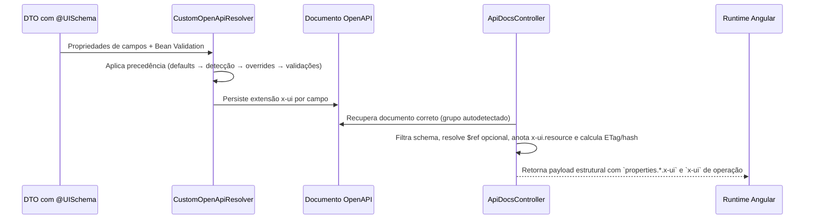

# Praxis Metadata Starter — Visão Arquitetural

A arquitetura do **Praxis Metadata Starter** foi desenhada para transformar **DTOs Java anotados**, **controllers metadata-driven** e **grupos OpenAPI dinâmicos** em uma superfície canônica composta por **OpenAPI enriquecido com `x-ui`**, **`/schemas/filtered`** e **`/schemas/catalog`**. Esta visão detalha os componentes principais, como eles se relacionam e como esse contrato é consumido pelas implementações de referência em `praxis-api-quickstart` e `praxis-ui-angular`.

## Camadas Principais

```mermaid
graph TD
    A[Aplicação Spring Boot] -->|Depende| B[Praxis Metadata Starter]
    B --> C[PraxisMetadataAutoConfiguration]
    B --> D[OpenApiUiSchemaAutoConfiguration]
    B --> E[Anotações e Resolvers]
    B --> F[Serviços Base e Filtros]
    B --> G[Docs Controllers]
    C -->|component scan| G
    C -->|component scan| H[DynamicSwaggerConfig]
    D -->|registra bean| I[CustomOpenApiResolver]
    D -->|registra bean| J[OpenApiGroupResolver]
    H -->|cria grupos| J
    E -->|@UISchema + Bean Validation| I
    E -->|@ApiResource/@ApiGroup| H
    I -->|enriquece| K[OpenAPI /v3/api-docs]
    G -->|filtra e projeta| L[/schemas/filtered]
    G -->|resume e cataloga| M[/schemas/catalog]
    K --> G
    L -->|consumo runtime| N[praxis-ui-angular]
    M -->|discovery, docs, RAG| O[Tooling e catálogos]
```

* **Auto-configurações** (`configuration`): `PraxisMetadataAutoConfiguration` faz `component scan` das áreas canônicas e `OpenApiUiSchemaAutoConfiguration` registra beans como `CustomOpenApiResolver`, `OpenApiGroupResolver`, `OpenApiDocsSupport` e `ApiDocsController`.
* **Anotações e resolvers** (`annotation`, `extension`): `@UISchema` e Bean Validation alimentam `CustomOpenApiResolver`; `@ApiResource` e `@ApiGroup` não geram `x-ui` de campo, mas governam base path e agrupamento OpenAPI usados na resolução documental.
* **Serviços Base** (`service.base`): `BaseCrudService` e derivados sustentam CRUD, opções, filtros e integração com repositórios/Specifications.
* **Controladores de documentação** (`controller.docs`): `ApiDocsController` expõe `GET /schemas/filtered`; `DomainCatalogController` expõe `GET /schemas/catalog`; ambos resolvem o grupo automaticamente a partir do `path`.
* **Metadados x-ui** (`FieldConfigProperties`, `ValidationProperties`): padronizam o vocabulário canônico consumido pelos runtimes Praxis.

## Fluxo de Enriquecimento x-ui



1. **Entrada**: DTOs anotados com `@UISchema` e validações Jakarta.
2. **Processamento**: `CustomOpenApiResolver` aplica heurísticas e gera `x-ui` coerente.
3. **Agrupamento OpenAPI**: `DynamicSwaggerConfig` registra `GroupedOpenApi` a partir de `@ApiResource`/`@ApiGroup`, e `OpenApiGroupResolver` escolhe o grupo correto pelo melhor match de path.
4. **Entrega estrutural**: `ApiDocsController` filtra o documento, pode expandir `$ref`, copia `x-ui` de operação, adiciona `x-ui.resource.idField/readOnly/capabilities`, injeta `operationExamples` e devolve apenas o payload estrutural necessário ao frontend.
5. **Entrega documental**: `DomainCatalogController` resume endpoints, exemplos e links para os schemas estruturais; ele não substitui `/schemas/filtered` para renderização runtime.

## Principais Componentes Técnicos

| Componente | Pacote | Responsabilidade | Quando estender/configurar |
|------------|--------|------------------|-----------------------------|
| `OpenApiUiSchemaAutoConfiguration` | `configuration` | Ativa resolvers, registradores e endpoints de documentação | Override quando precisar desligar peças automáticas em aplicações multi-módulo |
| `PraxisMetadataAutoConfiguration` | `configuration` | Faz `component scan` das camadas canônicas (`controller.docs`, `service`, `filter`, `configuration`) | Ajuste quando precisar controlar bootstrap/component scan do starter |
| `@UISchema` | `extension.annotation` | Declara propriedades visuais e comportamentais de campos | Estenda atributos via `extraProperties` ou metaprogramação |
| `DynamicSwaggerConfig` | `configuration` | Descobre controllers e cria `GroupedOpenApi` a partir de `@ApiResource`/`@ApiGroup` | Ajuste quando precisar alterar estratégia de agrupamento OpenAPI |
| `CustomOpenApiResolver` | `extension` | Aplica precedência de metadados e Bean Validation | Substitua para alterar heurísticas globais |
| `OpenApiGroupResolver` | `util` | Resolve o grupo OpenAPI mais específico a partir do `path` do recurso | Ajuste se precisar mudar o algoritmo de resolução de grupos |
| `ApiDocsController` | `controller.docs` | Expõe `/schemas/filtered` como contrato estrutural com cache e filtro | Habilite filtros customizados ou headers adicionais |
| `DomainCatalogController` | `controller.docs` | Expõe `/schemas/catalog` como superfície documental para exploração e RAG | Use quando precisar de exemplos operacionais, resumos e links para request/response schema |
| `Filterable` & Filtros | `filter.annotation`, `filter.dto`, `filter.specification` | Convertem DTOs em Specifications dinamicamente | Crie DTOs específicos por contexto e reutilize adaptadores |
| `BaseCrudService` | `service.base` | Implementa CRUD padrão com mapeamento de opções | Substitua métodos para lógica de negócio específica |

## Integração com SpringDoc e OpenAPI

1. `springdoc-openapi` publica `/v3/api-docs` com os esquemas da aplicação.
2. O starter registra `CustomOpenApiResolver` como `ModelResolver` para interceptar geração de schemas.
3. `ApiDocsController` consulta o documento adequado e aplica filtros específicos:
   - Resolução automática de grupo (`OpenApiGroupResolver`).
   - Substituição opcional de `$ref` por objetos expandidos.
   - Mescla do `x-ui` de operação com `operationExamples`, `idField`, `readOnly`, `capabilities` e `optionSources` quando aplicável.
4. `DomainCatalogController` usa o mesmo documento OpenAPI para expor um catálogo mais documental:
   - Resumos e descrições das operações.
   - Exemplos request/response.
   - Links diretos para os schemas estruturais em `/schemas/filtered`.

## Conformidade com Implementações de Referência

### `praxis-api-quickstart`

* O quickstart valida a cadeia real `DynamicSwaggerConfig -> OpenApiGroupResolver -> /schemas/catalog -> /v3/api-docs/{group} -> /schemas/filtered` em `OpenApiGroupResolutionIsolatedIntegrationTest`.
* Os testes de stats também comprovam que `DomainCatalogController` e `ApiDocsController` servem links e payloads coerentes para operações `request` e `response`, inclusive com `operationExamples`.
* Na prática, o quickstart é o host operacional de referência que demonstra o contrato do starter em rotas como `/api/human-resources/**`.

### `praxis-ui-angular`

* O consumo runtime principal ocorre via `/schemas/filtered`, não via `/schemas/catalog`.
* `GenericCrudService` deriva `path/operation/schemaType`, envia `If-None-Match`, reaproveita `ETag`/`X-Schema-Hash`, persiste `schemaId` e extrai `x-ui.resource.idField` para grid, form e filter.
* `SchemaMetadataClient` reforça o mesmo contrato para consumidores que trabalham diretamente com `baseUrl + query params`, inclusive com fallback para `304` sem cache local.
* Portanto, para Angular, `/schemas/catalog` é superfície auxiliar de discovery/documentação/tooling; a renderização metadata-driven depende do payload estrutural retornado por `/schemas/filtered`.

## Observabilidade e Cache

* **Cache in-memory**: `ApiDocsController` mantém cache em memória do documento OpenAPI por grupo e cache separado do hash do payload estrutural por `schemaId`, ambos em `ConcurrentHashMap`.
* **Headers HTTP**: `If-None-Match` é respeitado e retorna `304` quando não há alterações.
* **Headers expostos**: o payload estrutural retorna `ETag` forte e `X-Schema-Hash`, com `Access-Control-Expose-Headers` apropriado.
* **Logs**: `ApiDocsController`, `DomainCatalogController` e `CustomOpenApiResolver` utilizam SLF4J para rastrear grupos resolvidos, documentos carregados e propriedades aplicadas.

## Próximos Passos

* Leia a [visão de pacotes](packages-overview.md) para localizar rapidamente responsabilidades.
* Confira os [exemplos de DTO](examples/filter-dto.md) e [integrações Spring](examples/spring-integration.md).
* Aprofunde-se nos conceitos de [`@UISchema` e validações estendidas](concepts/ui-schema.md).
