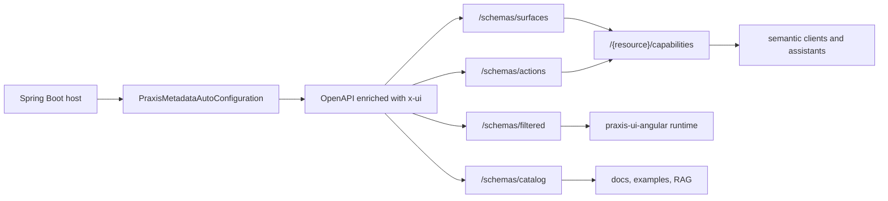
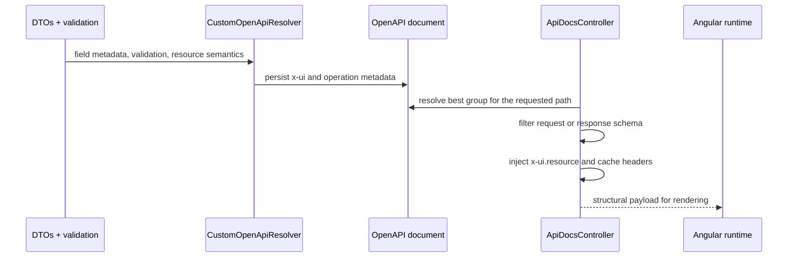
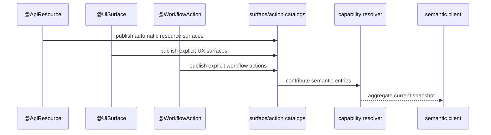

# Praxis Metadata Starter - Visao Arquitetural

A arquitetura atual do `praxis-metadata-starter` nao deve mais ser explicada
como "DTO anotado gera CRUD". O baseline canonico evoluiu para um sistema
resource-oriented que publica:

- OpenAPI enriquecido com `x-ui`
- `/schemas/filtered` como contrato estrutural
- `/schemas/catalog` como catalogo documental
- `/schemas/surfaces` e `/schemas/actions` como discovery semantico
- `/{resource}/capabilities` e `/{resource}/{id}/capabilities` como snapshot agregado
- `RestApiResponse` com Spring HATEOAS efetivo

## 1. O Que E Canonicamente Publicado

O contrato estrutural e o discovery semantico tem papeis diferentes:

- `/schemas/filtered` e a superficie lida pelo runtime para renderizacao
- `/schemas/catalog` organiza exemplos, links e sumarios para exploracao
- `/schemas/surfaces` e `/schemas/actions` publicam catalogos semanticos
- `/{resource}/capabilities` agrega o que pode ser feito agora sem virar um schema alternativo

## 2. Baseline De Modelagem

Para aplicacoes novas, o baseline correto e:

- `AbstractResourceController`
- `AbstractReadOnlyResourceController`
- `AbstractBaseResourceService`
- `AbstractReadOnlyResourceService`
- `ResourceMapper`
- `@ApiResource(value = ..., resourceKey = ...)`

O modelo esperado separa:

- `ResponseDTO`
- `CreateDTO`
- `UpdateDTO`
- `FilterDTO`

`@UISchema` continua relevante para metadados de campo, mas ele ja nao descreve
sozinho a arquitetura publica do starter.

## 3. Camadas Principais

### Auto-configuracao

- `PraxisMetadataAutoConfiguration`
- `OpenApiUiSchemaAutoConfiguration`
- `DynamicSwaggerConfig`

Essas pecas registram controllers, resolvers, grouped OpenAPI e o suporte de
docs/discovery.

### Resolucao de contrato

- `CustomOpenApiResolver`
- `OpenApiGroupResolver`
- `OpenApiDocsSupport`

Aqui o starter transforma DTOs, Bean Validation e metadata de recurso em
OpenAPI enriquecido e grupos canonicamente resolvidos por `path`.

### Publicacao de docs e discovery

- `ApiDocsController`
- `DomainCatalogController`
- `SurfaceCatalogController`
- `ActionCatalogController`

Esses controllers nao sao equivalentes entre si:

- `ApiDocsController` publica o payload estrutural
- `DomainCatalogController` publica o catalogo documental
- `SurfaceCatalogController` publica surfaces canonicas do recurso
- `ActionCatalogController` publica workflow actions canonicamente anotadas

### Semantica de recurso

- `@ApiResource`
- `@ResourceIntent`
- `@UiSurface`
- `@WorkflowAction`
- resolvers de capability

Aqui a arquitetura sai do antigo "CRUD com metadata" e passa para semantica de
recurso, experiencia e acao de negocio.

## 4. Fluxo Estrutural

Esse fluxo ainda e o centro do runtime oficial.

O que mudou foi a semantica ao redor dele:

- `x-ui.resource.capabilities` nao e mais o unico discovery relevante
- a plataforma agora diferencia contrato estrutural de catalogos semanticos
- item-level discovery e agregado contextual ganharam papel de primeira classe

## 5. Fluxo Semantico

Regras importantes:

- `surfaces` automaticas continuam existindo para o recurso canonico
- `actions` dependem de workflow explicito; ausencia pode resultar em `404`
- `capabilities` agrega ausencia de `surfaces` e `actions` como listas vazias
- entradas `ITEM` em catalogos globais sao discovery-only ate existir `resourceId`

## 6. Spring HATEOAS Faz Parte Da Arquitetura

HATEOAS nao e detalhe de serializacao.

Ele compoe a semantica publica em:

- `_links` de `RestApiResponse`
- links canonicamente montados pelos controllers base
- navegacao entre recurso, schema e operacoes
- coerencia entre contrato publicado e affordances HTTP

Quando o host desliga HATEOAS, a plataforma perde links, nao a semantica
canonica de recurso e discovery.

## 7. Consumidores De Referencia

### `praxis-api-quickstart`

E o host operacional de referencia. Ele prova:

- resolucao de grupos OpenAPI por `path`
- publicacao coerente de `/schemas/catalog`
- publicacao coerente de `/schemas/filtered`
- discovery resource-oriented
- consistencia entre stats, resource semantics e examples

### `praxis-ui-angular`

E o runtime oficial. Ele consome:

- `/schemas/filtered`
- `ETag`
- `X-Schema-Hash`
- `x-ui.resource.idField`

Ele pode tambem usar discovery semantico novo, mas o contrato estrutural segue
sendo a base do runtime.

## 8. O Que Nao Deve Ser Repetido Na Documentacao Publica

Nao explicar o starter como se ele fosse:

- apenas um gerador de CRUD
- apenas `@UISchema` + `AbstractCrudController`
- um sistema em que `/schemas/catalog` substitui `/schemas/filtered`
- um backend que publica schema estrutural sem semantica de recurso

Essas leituras ficaram historicamente incompletas.

## 9. Referencias

- [README.md](README.md)
- [guides/index.md](guides/index.md)
- [guides/GUIA-01-AI-BACKEND-APLICACAO-NOVA.md](guides/GUIA-01-AI-BACKEND-APLICACAO-NOVA.md)
- [guides/GUIA-04-QUANDO-USAR-RESOURCE-SURFACE-ACTION-CAPABILITY.md](guides/GUIA-04-QUANDO-USAR-RESOURCE-SURFACE-ACTION-CAPABILITY.md)
- [spec/CONFORMANCE.md](spec/CONFORMANCE.md)
