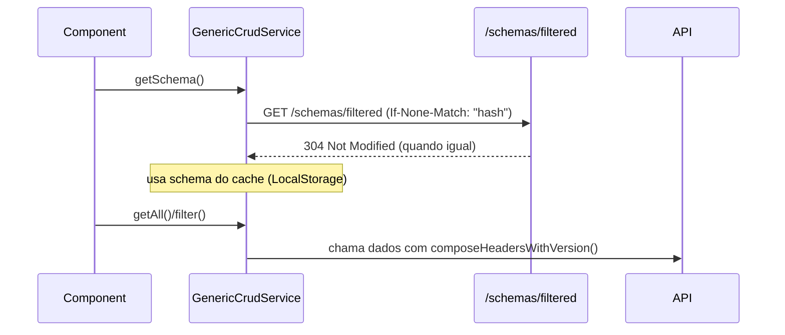

# Self‑describing APIs

## Definição curta
APIs que publicam, junto aos endpoints de dados, um contrato rico e interpretável em tempo de execução (ex.: OpenAPI + extensões `x-ui`) que descreve recursos, campos, validações e preferências de UI. O frontend consome esses contratos para se configurar dinamicamente, sem codegen.

## Onde aparece no Praxis
- Backend: `backend-libs/praxis-metadata-starter/src/main/java/org/praxisplatform/uischema/controller/docs/ApiDocsController.java:114` — expõe `GET /schemas/filtered` com enriquecimentos `x-ui` e `x-ui.resource.idField`.
- Backend: `backend-libs/praxis-metadata-starter/README.md:797` — Cheatsheet do `/schemas/filtered` e precedência de metadados.
- Frontend: `frontend-libs/praxis-ui-workspace/projects/praxis-core/src/lib/services/generic-crud.service.ts:273` — `getSchema()` resolve `/schemas/filtered` (ETag/If-None-Match, cache e version headers).
- Frontend: `frontend-libs/praxis-ui-workspace/projects/praxis-table/README.md:110` — fluxo de `resourcePath` → schema → dados (mermaid).
- Guias: `docs/backend-api-ui-audit.md` — auditoria do contrato x‑ui e consumo.

## Como aplicar (passo a passo)
1) Anote DTOs/entidades com `@UISchema` para gerar extensões `x-ui` no OpenAPI.
2) Publique o endpoint `/schemas/filtered` (já incluso no starter) e garanta `x-ui.resource.idField` corretamente.
3) No frontend, use `GenericCrudService.configure(resourcePath)` e `getSchema()`/`getFilterSchema()`.
4) Nos componentes (`<praxis-table>`, forms dinâmicos), informe `resourcePath` e deixe a geração automática usar o contrato.

## Exemplos mínimos
- Snippet backend (resolver):
  - `backend-libs/praxis-metadata-starter/src/main/java/org/praxisplatform/uischema/controller/docs/ApiDocsController.java:273`
- Snippet frontend (consumo):
  - `frontend-libs/praxis-ui-workspace/projects/praxis-core/src/lib/services/generic-crud.service.ts:299`

## Anti‑padrões
- Acoplar colunas/labels no frontend ignorando `x-ui` do contrato.
- Versionar manualmente schemas sem respeitar `ETag`/`If-None-Match` e cabeçalhos de versão.

## Referências internas
- backend-libs/praxis-metadata-starter/README.md:603
- backend-libs/praxis-metadata-starter/src/main/java/org/praxisplatform/uischema/controller/base/AbstractCrudController.java:191
- frontend-libs/praxis-ui-workspace/projects/praxis-core/src/lib/services/generic-crud.service.ts:1182
- frontend-libs/praxis-ui-workspace/projects/praxis-table/README.md:524
- docs/SCHEMA-INTEGRATION-PLAN.md
## Evolução de Schema (ETag, versão e compatibilidade)

- Headers envolvidos

| Header | Origem | Uso |
|---|---|---|
| `ETag` | Resposta `/schemas/filtered` | Hash do schema retornado (versão forte do contrato)
| `If-None-Match` | Requisição `/schemas/filtered` | Revalidação condicional; 304 quando não mudou
| `X-Data-Version` (custom) | Requisição/Resposta | Indicar versão lógica de dados quando aplicável

- Fluxo de revalidação (browser → contrato → dados)



- Receitas
  - Primeira carga: chame `getSchema()` sem `If-None-Match`; persista `schemaHash` localmente.
  - Revalidação: reenvie `If-None-Match: "hash"`; em 304, evite baixar corpo (melhor UX/latência).
  - Mudança compatível (non‑breaking): incremente `ETag`; garanta forwards‑compat em labels/hints.
  - Mudança breaking: marque versão lógica (ex.: `X-Data-Version`), mantenha janela de compatibilidade com fallback/feature flags.

## Testabilidade / contratos em teste

- Frontend (Angular):
  - Use `HttpTestingController` para mockar `GET /schemas/filtered` retornando um schema fixture e valide que o componente gera colunas/campos esperados.
  - Exemplo (esqueleto):

```ts
it('gera colunas a partir do schema', () => {
  crud.configure('items');
  service.getSchema().subscribe(schema => expect(schema.length).toBeGreaterThan(0));
  const req = http.expectOne(/\\/schemas\\/filtered/);
  req.flush(mockSchema, { headers: { ETag: '\"abc\"' } as any });
});
```

- Backend (Spring):
  - Teste `ApiDocsController` com `MockMvc`, validando presença de `x-ui` e `x-ui.resource.idField`.

## Segurança e escopo (RLS, “chapéus”)

- Delegue políticas de visibilidade/escopo a Specifications e Context Variables no Visual Builder.
- Aplique regras por “papel” (role/tenant) tanto no enriquecimento do contrato quanto na avaliação em UI (Policy‑as‑code).

## Veja também
- [UI Schema vs Data Schema](./ui-schema-vs-data-schema.md)
- [Schema‑driven UI](./schema-driven-ui.md)
- [Configuration‑driven development](./configuration-driven-development.md)
- [Rules Engines & Specifications](./rules-engines-and-specifications.md)

