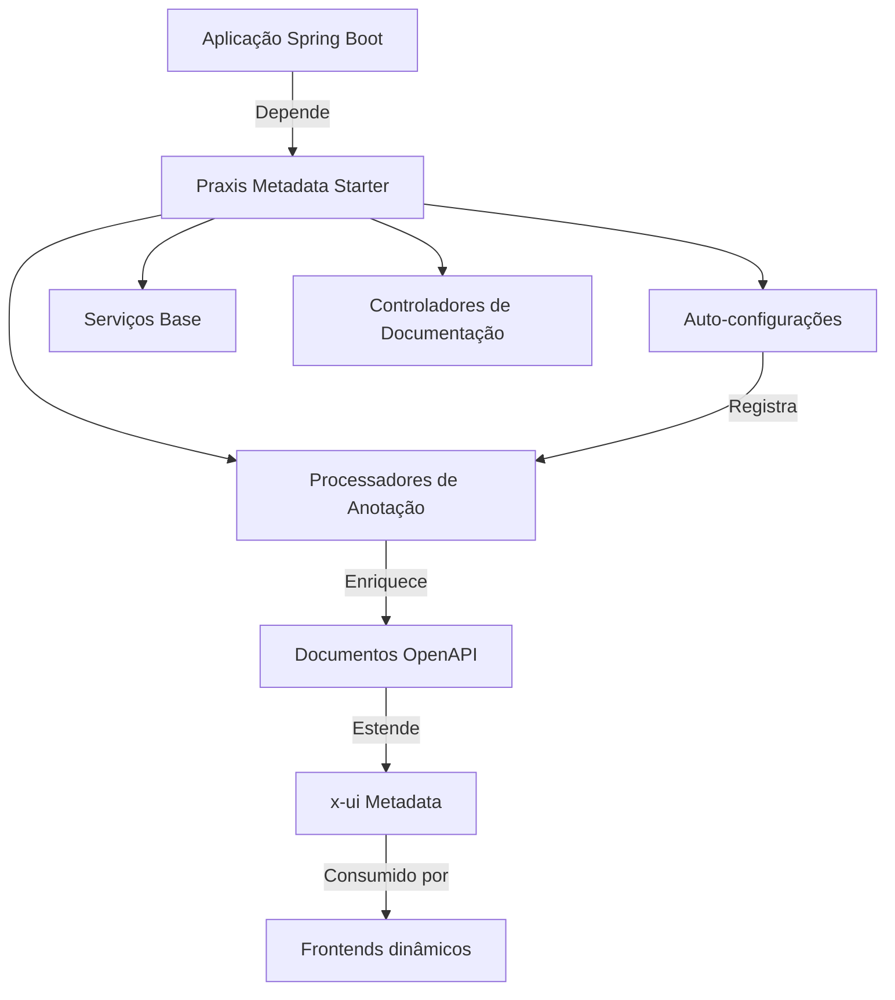
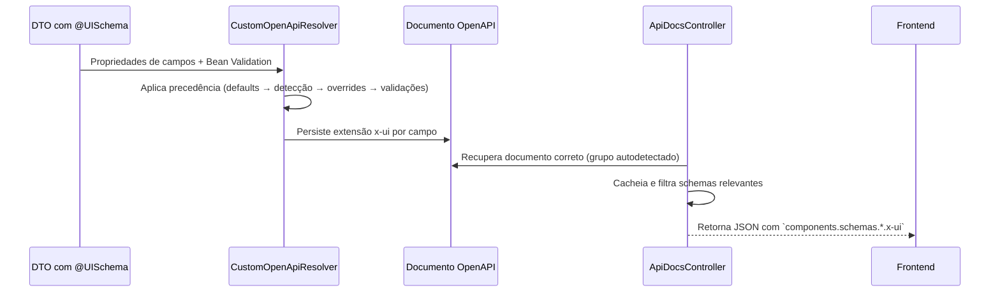

# Praxis Metadata Starter — Visão Arquitetural

A arquitetura do **Praxis Metadata Starter** foi desenhada para transformar **DTOs Java anotados** em **documentos OpenAPI enriquecidos com metadados `x-ui`**. Esta visão detalha os componentes principais, como eles se relacionam e quais extensões estão disponíveis para personalização.

## Camadas Principais

* **Auto-configurações** (`configuration`): ativadas pelo Spring Boot, ligam processadores, resolvers e registram beans obrigatórios.
* **Processadores de Anotação** (`annotation`, `extension`): interpretam `@UISchema`, `@Filterable`, `@ApiResource` e geram metadados.
* **Serviços Base** (`service.base`): definem contratos CRUD, mapeamento de opções e integração com repositórios e filtros.
* **Controladores** (`controller.docs`): expõem endpoints como `/schemas/filtered`, resolvendo automaticamente grupos OpenAPI.
* **Metadados x-ui** (`FieldConfigProperties`, `ValidationProperties`): padronizam chaves para consumo dos frontends Praxis.

## Fluxo de Enriquecimento x-ui

1. **Entrada**: DTOs anotados com `@UISchema` e validações Jakarta.
2. **Processamento**: `CustomOpenApiResolver` aplica heurísticas e gera `x-ui` coerente.
3. **Entrega**: `ApiDocsController` filtra o documento, injeta traduções, resolve `$ref` e devolve apenas o necessário ao frontend.

## Principais Componentes Técnicos

| Componente | Pacote | Responsabilidade | Quando estender/configurar |
|------------|--------|------------------|-----------------------------|
| `OpenApiUiSchemaAutoConfiguration` | `configuration` | Ativa resolvers, registradores e endpoints de documentação | Override quando precisar desligar peças automáticas em aplicações multi-módulo |
| `@UISchema` | `extension.annotation` | Declara propriedades visuais e comportamentais de campos | Estenda atributos via `extraProperties` ou metaprogramação |
| `CustomOpenApiResolver` | `extension` | Aplica precedência de metadados e Bean Validation | Substitua para alterar heurísticas globais |
| `ApiDocsController` | `controller.docs` | Exponde `/schemas/filtered` com cache e filtro | Habilite filtros customizados ou headers adicionais |
| `Filterable` & Filtros | `filter.annotation`, `filter.dto`, `filter.specification` | Convertem DTOs em Specifications dinamicamente | Crie DTOs específicos por contexto e reutilize adaptadores |
| `BaseCrudService` | `service.base` | Implementa CRUD padrão com mapeamento de opções | Substitua métodos para lógica de negócio específica |

## Integração com SpringDoc e OpenAPI

1. `springdoc-openapi` publica `/v3/api-docs` com os esquemas da aplicação.
2. O starter registra `CustomOpenApiResolver` como `ModelResolver` para interceptar geração de schemas.
3. `ApiDocsController` consulta o documento adequado e aplica filtros específicos:
   - Resolução automática de grupo (`OpenApiGroupResolver`).
   - Substituição opcional de `$ref` por objetos expandidos.
   - Conversão de mensagens de validação em `x-ui.validation`.

## Observabilidade e Cache

* **Cache in-memory**: resultados de `/v3/api-docs/{group}` são guardados em `ConcurrentHashMap` com ETag calculada a partir do schema filtrado.
* **Headers HTTP**: `If-None-Match` é respeitado e retorna `304` quando não há alterações.
* **Logs**: `ApiDocsController` e `CustomOpenApiResolver` utilizam SLF4J para rastrear grupos resolvidos e propriedades aplicadas.

## Próximos Passos

* Leia a [visão de pacotes](packages-overview.md) para localizar rapidamente responsabilidades.
* Confira os [exemplos de DTO](examples/filter-dto.md) e [integrações Spring](examples/spring-integration.md).
* Aprofunde-se nos conceitos de [`@UISchema` e validações estendidas](concepts/ui-schema.md).
