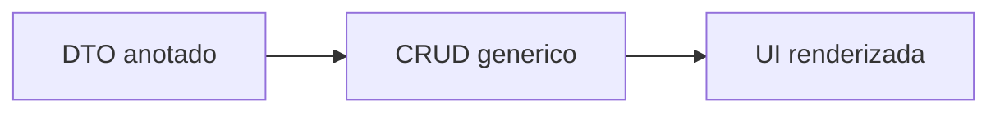
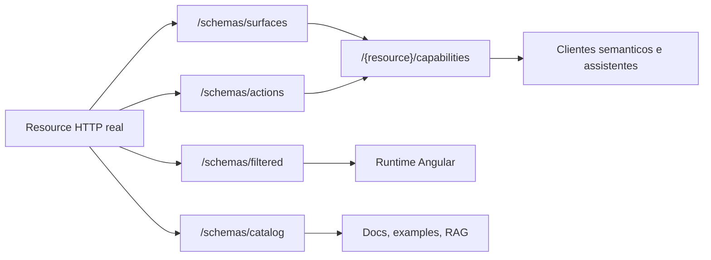
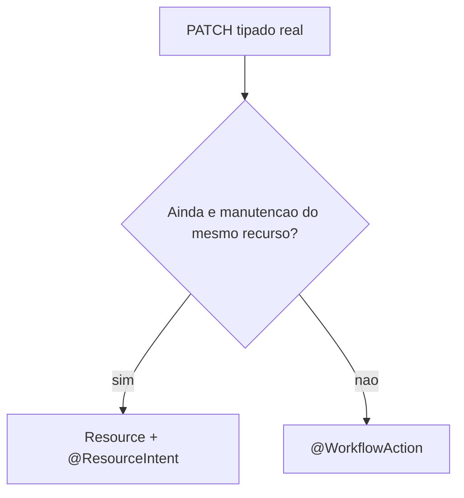
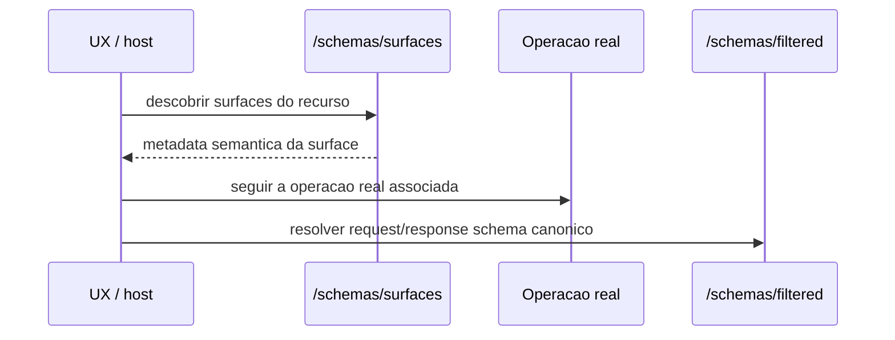
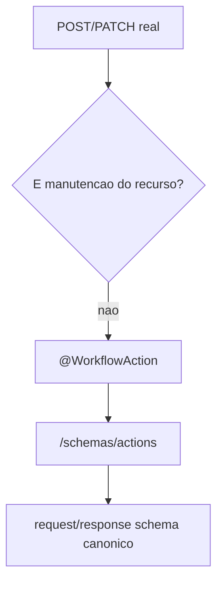
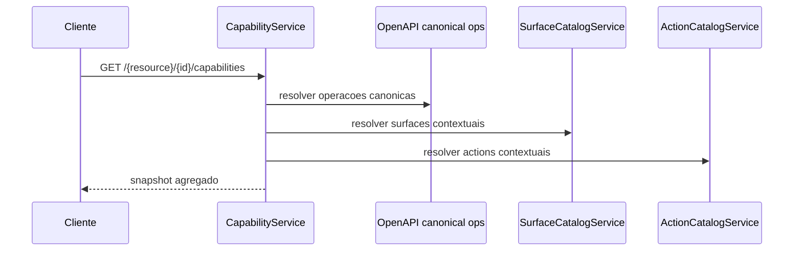
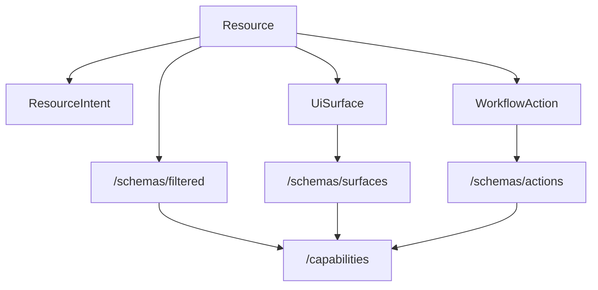

# Guia 05 - Do CRUD ao Contrato Semantico

## Objetivo

Este guia mostra visualmente por que o `praxis-metadata-starter` nao deve ser
lido como "CRUD com DTO anotado".

O ponto central e este:

- `resource` continua sendo o contrato canonico
- `surface` adiciona descoberta semantica de experiencia
- `workflow action` adiciona descoberta semantica de comando de negocio
- `capabilities` agrega o que pode ser feito agora
- tudo isso continua apontando para operacoes HTTP reais e schemas canonicos

## A leitura correta do contrato

Uma leitura simplificada seria:

O contrato canonico do starter e:

Praxis continua tendo CRUD quando o recurso realmente e CRUD.
O ganho da plataforma esta no que aparece em volta dele.

## Camada 1 - Resource continua sendo a fonte da verdade

`resource` continua definindo:

- path HTTP real
- payload real
- schema real
- operacoes reais

Exemplos canonicos:

- `GET /employees/{id}`
- `POST /employees`
- `PUT /employees/{id}`
- `POST /employees/filter`

O que mudou:

- o recurso agora nasce com `resourceKey`
- o recurso passa a ser indexado por discovery
- o recurso passa a publicar links e snapshots agregados

## Camada 2 - ResourceIntent evita transformar tudo em workflow

Nem todo `PATCH` com nome proprio e workflow.

Exemplo:

- `PATCH /employees/{id}/profile`

Se o endpoint ainda atualiza parte do mesmo recurso:

- continua sendo `resource`
- pode receber `@ResourceIntent`
- pode receber `@UiSurface` se a UX precisar discovery semantico

Ele nao precisa virar workflow apenas porque tem nome.

## Camada 3 - UiSurface publica experiencia, nao payload

`@UiSurface` nao cria schema novo.
Ela aponta para uma operacao real e para o schema canonico daquela operacao.

Isso permite modelar:

- formulario parcial
- detalhe especializado
- projecao de leitura
- experiencia contextual por item

Sem duplicar contrato de payload.

## Camada 4 - WorkflowAction publica comando de negocio

`@WorkflowAction` e o eixo em que o Praxis vai claramente alem do CRUD.

Exemplos:

- `approve`
- `reject`
- `resubmit`
- `bulk-approve`

Regras reais do starter:

- action nao cria dispatcher generico
- action nao substitui endpoint real
- action nao publica payload inline
- action aparece no catalogo semantico por referencia ao request/response schema

No codigo, isso e resolvido por scanner real de handlers em:

- `AnnotationDrivenActionDefinitionRegistry`

## Camada 5 - Capabilities agregam o que existe agora

`capabilities` existem para responder a pergunta:

"o que esta disponivel agora para este recurso ou para esta instancia?"

O snapshot agrega:

- operacoes canonicas do recurso
- surfaces disponiveis
- actions disponiveis

Sem substituir:

- `/schemas/filtered`
- `/schemas/surfaces`
- `/schemas/actions`

Ou seja:

- `filtered` continua sendo contrato estrutural
- `capabilities` vira contrato agregado de disponibilidade

## Como os conceitos se encaixam

Leitura correta do diagrama:

- `ResourceIntent` continua dentro do eixo `resource`
- `UiSurface` publica uma experiencia semantica sobre operacao real
- `WorkflowAction` publica um comando de negocio
- `capabilities` e a agregacao desses eixos

## O que isso habilita na pratica

Com esse modelo, o backend passa a publicar mais do que endpoints.

Ele publica:

- estrutura para renderizacao
- identidade semantica do recurso
- experiencias de UI descobriveis
- comandos de negocio descobriveis
- snapshot de disponibilidade contextual
- links HATEOAS efetivos

Isso habilita:

- runtime Angular mais inteligente
- catálogos documentais e RAG
- clientes semanticos
- assistentes que descobrem o que podem fazer sem hardcode local

## Exemplo mental rapido

Considere um recurso `eventos-folha`.

Ele pode ter:

- `GET /eventos-folha/{id}` -> resource
- `PATCH /eventos-folha/{id}/profile` -> resource + `@ResourceIntent`
- `PATCH /eventos-folha/{id}/profile` + `@UiSurface` -> a UX descobre um formulario parcial real
- `POST /eventos-folha/actions/bulk-approve` + `@WorkflowAction` -> comando de negocio de colecao
- `GET /eventos-folha/capabilities` -> snapshot agregado

O ponto nao e "ter mais endpoints".
O ponto e publicar semantica de plataforma sobre endpoints reais.

## Regra de ouro

Praxis nao vai alem do CRUD porque inventa uma segunda API.

Praxis vai alem do CRUD porque:

- preserva o recurso como fonte da verdade
- adiciona discovery semantico sobre operacoes reais
- agrega disponibilidade contextual
- mantem tudo ligado a schema canonico e HATEOAS

## Onde isso aparece no starter

- arquitetura geral: `docs/architecture-overview.md`
- decisao semantica: `docs/guides/GUIA-04-QUANDO-USAR-RESOURCE-SURFACE-ACTION-CAPABILITY.md`
- discovery de surfaces: `AnnotationDrivenSurfaceDefinitionRegistry`
- discovery de actions: `AnnotationDrivenActionDefinitionRegistry`
- snapshot agregado: `DefaultCapabilityService`
- endpoints contextuais e links: `AbstractResourceQueryController`

## Referencias

- `docs/architecture-overview.md`
- `docs/guides/GUIA-04-QUANDO-USAR-RESOURCE-SURFACE-ACTION-CAPABILITY.md`
- `src/main/java/org/praxisplatform/uischema/surface/AnnotationDrivenSurfaceDefinitionRegistry.java`
- `src/main/java/org/praxisplatform/uischema/action/AnnotationDrivenActionDefinitionRegistry.java`
- `src/main/java/org/praxisplatform/uischema/capability/DefaultCapabilityService.java`
- `src/main/java/org/praxisplatform/uischema/controller/base/AbstractResourceQueryController.java`
