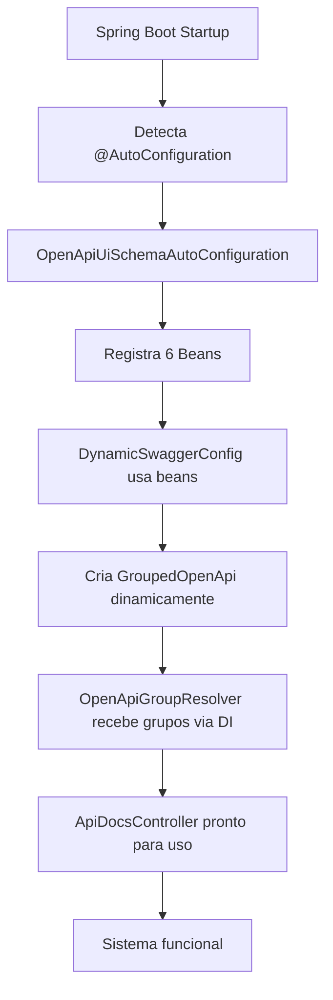

# 🏗️ Auto-Configuração do Praxis UI Schema

## 📋 Visão Geral

O `OpenApiUiSchemaAutoConfiguration` é o **"bootstrap"** de todo o sistema Praxis UI Schema, implementando o padrão **"Convention over Configuration"** do Spring Boot para que desenvolvedores apenas adicionem a dependência e todo o sistema fique automaticamente disponível.

## 🎯 Objetivo Principal

**Zero Setup Experience**: Desenvolvedores apenas precisam:
1. Adicionar a dependência no `pom.xml`
2. Usar `@ApiResource` nos controllers
3. Todo o sistema funciona automaticamente

## ⚙️ Propriedades de Configuração

| Propriedade | Padrão | Descrição |
|-------------|--------|-----------|
| `praxis.query.by-ids.max` | `200` | Limite de IDs aceitos pelo endpoint `GET /{resource}/by-ids`. Ajuda a evitar consultas excessivas em ambientes corporativos. |
| `praxis.pagination.max-size` | `200` | Tamanho máximo de página aceito pelos endpoints paginados (`/filter` e `/options/filter`). Evita requisições muito grandes que possam degradar o sistema. |

## 🏗️ Duas Auto-Configurações Complementares

O sistema Praxis possui **duas auto-configurações** que trabalham em conjunto:

| Auto-Configuração | Responsabilidade | Execução |
|-------------------|------------------|----------|
| **PraxisMetadataAutoConfiguration** | 🏗️ Infraestrutura base + Component Scan | 1º - Fundação |
| **OpenApiUiSchemaAutoConfiguration** | 🎨 Beans funcionais do UI Schema | 2º - Funcionalidade |

### ⚡ Ordem de Execução
1. **PraxisMetadataAutoConfiguration** → Detecta componentes via @ComponentScan
2. **OpenApiUiSchemaAutoConfiguration** → Registra beans específicos
3. **DynamicSwaggerConfig** → Detectado via component scan, executa @PostConstruct
4. **Validação** → Executada via @EventListener após startup completo

## 🔧 Beans da PraxisMetadataAutoConfiguration

### 🔢 BigDecimal OpenApiCustomizer
- **Função**: Mapeia BigDecimal para "number"/"decimal" nos schemas
- **Problema resolvido**: Inconsistência no mapeamento padrão do SpringDoc
- **Benefício**: Frontends sabem como tratar valores decimais corretamente

### 🏗️ Grupo "praxis-metadata-infra" 
- **Função**: Documentação dos endpoints internos do framework (/schemas/**)
- **Separação**: Infraestrutura isolada dos endpoints de aplicação
- **Tamanho**: ~2-5KB (documentação leve e focada)

### 🌐 Grupo "application" (Fallback)
- **Função**: Captura todos os endpoints não categorizados em grupos específicos
- **Uso**: Controllers legados, endpoints de sistema (/health, /actuator)
- **Indicador**: Se endpoints de negócio aparecem aqui, precisam migrar para @ApiResource

## 🔧 Beans da OpenApiUiSchemaAutoConfiguration

### 📡 RestTemplate (`openApiUiSchemaRestTemplate`)
- **Função**: Comunicação HTTP interna com SpringDoc OpenAPI
- **Características**: Nome específico para evitar conflitos
- **Uso**: Chamadas internas do ApiDocsController

### 📝 ObjectMapper (`openApiUiSchemaObjectMapper`)  
- **Função**: Serialização/deserialização JSON de schemas
- **Características**: Suporte completo a Java Time API (LocalDate, LocalDateTime, etc.)
- **Uso**: Processamento de metadados UI e schemas OpenAPI

### 🔍 CustomOpenApiResolver
- **Função**: Enriquece schemas OpenAPI com metadados UI
- **Características**: Processa anotações @UISchema e adiciona informações de interface
- **Uso**: Transforma schemas técnicos em configurações para componentes UI

### 📋 GenericSpecificationsBuilder
- **Função**: Cria filtros JPA automaticamente a partir de DTOs
- **Características**: Genérico (`<E>`), funciona com qualquer entidade
- **Uso**: Endpoints `/filter` dos AbstractCrudController

### 🎯 OpenApiGroupResolver (**CRÍTICO**)
- **Função**: **Componente mais importante** - resolve automaticamente grupos OpenAPI
- **Características**: Implementa algoritmo "best match" para encontrar grupo mais específico  
- **Uso**: Elimina necessidade do parâmetro 'document' no ApiDocsController

### 🌐 ApiDocsController
- **Função**: Exposição de endpoints de documentação filtrada
- **Características**: API RESTful para consumo por frontends
- **Uso**: `/schemas/filtered` com resolução automática de grupos

## 🔄 Fluxo de Inicialização



## 🎪 Arquitetura Completa de Auto-Configuração

```
┌─────────────────────────────────────────────┐
│     PraxisMetadataAutoConfiguration         │
│  🏗️ Infraestrutura + Component Scan        │
└─────────────────┬───────────────────────────┘
                  │ @ComponentScan detecta
                  ▼
┌─────────────────────────────────────────────┐
│  🔢 BigDecimal Customizer                   │
│  🏗️ Grupo "praxis-metadata-infra"          │  
│  🌐 Grupo "application" (fallback)          │
│  📦 @ComponentScan packages                 │
└─────────────────┬───────────────────────────┘
                  │ + registra beans específicos
                  ▼
┌─────────────────────────────────────────────┐
│    OpenApiUiSchemaAutoConfiguration         │
│  🎨 Beans funcionais do UI Schema           │
└─────────────────┬───────────────────────────┘
                  │ registra beans
                  ▼
┌─────────────────────────────────────────────┐
│  📡 RestTemplate (HTTP interno)             │
│  📝 ObjectMapper (JSON + JavaTime)         │  
│  🔍 CustomOpenApiResolver (schemas + UI)    │
│  📋 GenericSpecificationsBuilder (filtros)  │
│  🎯 OpenApiGroupResolver (resolução grupos) │
│  🌐 ApiDocsController (endpoints REST)      │
└─────────────────┬───────────────────────────┘
                  │ componentes detectados + beans injetados
                  ▼
┌─────────────────────────────────────────────┐
│       DynamicSwaggerConfig                  │
│       AbstractCrudController               │
│       PraxisMetadataProvider               │
│       Outros componentes detectados        │
└─────────────────────────────────────────────┘
```

## 🚀 Benefícios para Desenvolvedores

### ✅ Plug & Play
```xml
<!-- Apenas isso no pom.xml: -->
<dependency>
    <groupId>io.github.codexrodrigues</groupId>
    <artifactId>praxis-metadata-starter</artifactId>
</dependency>
```

### ✅ Zero Boilerplate
```java
// Sem necessidade de configurar beans manualmente:
@Configuration
public class MyConfig {
    // ❌ NÃO precisa disso:
    // @Bean public RestTemplate restTemplate() { ... }
    // @Bean public ObjectMapper objectMapper() { ... }
    // @Bean public OpenApiGroupResolver resolver() { ... }
}

// ✅ Apenas use diretamente:
@ApiResource(ApiPaths.FUNCIONARIOS)
public class FuncionarioController extends AbstractCrudController<...> {
    // Tudo funciona automaticamente!
}
```

### ✅ Não Conflitante
- Usa `@ConditionalOnMissingBean` para respeitar configurações customizadas
- Nomes específicos nos beans para evitar colisões
- Permite sobrescrita com `@Primary` se necessário

## ⚙️ Customização Avançada

### Sobrescrever ObjectMapper
```java
@Configuration
public class MyCustomConfig {
    
    @Bean
    @Primary // substitui o bean padrão
    public ObjectMapper myObjectMapper() {
        ObjectMapper mapper = new ObjectMapper();
        mapper.registerModule(new JavaTimeModule());
        mapper.configure(DeserializationFeature.FAIL_ON_UNKNOWN_PROPERTIES, false);
        // suas customizações específicas...
        return mapper;
    }
}
```

### Sobrescrever RestTemplate
```java
@Bean
@Primary
public RestTemplate myRestTemplate() {
    RestTemplate template = new RestTemplate();
    
    // Configurar timeouts:
    HttpComponentsClientHttpRequestFactory factory = 
        new HttpComponentsClientHttpRequestFactory();
    factory.setConnectTimeout(5000);
    factory.setReadTimeout(10000);
    template.setRequestFactory(factory);
    
    return template;
}
```

## 🔗 Integração com Spring Boot

### META-INF/spring/org.springframework.boot.autoconfigure.AutoConfiguration.imports
```
org.praxisplatform.uischema.configuration.OpenApiUiSchemaAutoConfiguration
org.praxisplatform.uischema.configuration.PraxisMetadataAutoConfiguration
```

### Ordem de Inicialização
1. **OpenApiUiSchemaAutoConfiguration** registra beans base
2. **PraxisMetadataAutoConfiguration** adiciona component scan
3. **DynamicSwaggerConfig** usa beans para criar grupos
4. **Spring Boot** completa inicialização
5. **Sistema pronto** para uso

## 📊 Impacto na Performance

### Documentação OpenAPI
- **Sem grupos**: Um documento gigante (~500KB+)
- **Com auto-configuração**: Documentos específicos (~14KB cada)
- **Redução**: 97% no tamanho dos documentos

### Tempo de Resposta
- **Cache interno**: Evita reprocessamento desnecessário
- **Resolução otimizada**: Algoritmo O(n) para encontrar grupos
- **Lazy loading**: Componentes carregados sob demanda

## ❓ Troubleshooting

### Bean não está sendo injetado
```bash
# Verificar se a auto-configuração está sendo detectada:
--debug

# Buscar logs:
[INFO] OpenApiUiSchemaAutoConfiguration matched:
   - @ConditionalOnMissingBean (types: org.springframework.web.client.RestTemplate)
```

### Conflito de beans
```java
// Se houver conflito, usar @Qualifier:
@Autowired
@Qualifier("openApiUiSchemaRestTemplate")
private RestTemplate restTemplate;
```

### Debug de grupos criados
```java
// No DynamicSwaggerConfig, os logs mostrarão:
[INFO] Bean GroupedOpenApi registrado: bean=funcionarios_ApiGroup, group=funcionarios, paths=/api/funcionarios/**
```

## 🤝 Complementaridade das Auto-Configurações

### PraxisMetadataAutoConfiguration (Fundação)
- **Quando executa**: Primeiro, durante boot da aplicação
- **O que faz**: 
  - 📦 **@ComponentScan**: Detecta DynamicSwaggerConfig, ApiDocsController, Services
  - 🔢 **Type Mapping**: Configura BigDecimal → number/decimal
  - 🏗️ **Base Groups**: Cria grupos de infraestrutura e fallback
- **Resultado**: Componentes detectados e disponíveis para injeção

### OpenApiUiSchemaAutoConfiguration (Funcionalidade)
- **Quando executa**: Segundo, depois do component scan
- **O que faz**:
  - 📡 **Infraestrutura**: RestTemplate, ObjectMapper com JavaTime
  - 🔍 **Processamento**: CustomOpenApiResolver para schemas
  - 📋 **Filtros**: GenericSpecificationsBuilder para JPA
  - 🎯 **Resolução**: OpenApiGroupResolver (componente crítico)
- **Resultado**: Beans funcionais injetados nos componentes detectados

### Como Trabalham Juntas
```java
// 1. PraxisMetadataAutoConfiguration detecta via @ComponentScan:
@Configuration  // ← Detectado pelo component scan
public class DynamicSwaggerConfig {
    
    // 2. OpenApiUiSchemaAutoConfiguration fornece via DI:
    @Autowired 
    private OpenApiGroupResolver resolver; // ← Injetado automaticamente
}
```

### Resultado Final
- **Zero configuração manual**: Desarrollador só adiciona dependência
- **Integração perfeita**: Componentes se conectam automaticamente
- **Funcionalidade completa**: Resolução automática de grupos funciona
- **Validação automática**: Controllers são validados para conformidade

## 📚 Referências

- [Spring Boot Auto-Configuration](https://docs.spring.io/spring-boot/docs/current/reference/html/features.html#features.developing-auto-configuration)
- [SpringDoc OpenAPI GroupedOpenApi](https://springdoc.org/#how-can-i-separate-different-api-definitions)
- [PraxisMetadataAutoConfiguration.java](src/main/java/org/praxisplatform/uischema/configuration/PraxisMetadataAutoConfiguration.java)
- [OpenApiUiSchemaAutoConfiguration.java](src/main/java/org/praxisplatform/uischema/configuration/OpenApiUiSchemaAutoConfiguration.java)
- [Praxis Metadata Starter README](README.md)
- [Validação @ApiResource](VALIDACAO-API-RESOURCE.md)
